>  style="width:0.85556in;height:0.82955in" />**IMPLEMENTACIÓN** **DE**
> **UN** **ENTORNO** **VIRTUALIZADO** **CON** **HYPER-V** **Y**
> **SERVIDOR** **WEB** **EN** **DEBIAN**
>
> **PROYECTO** **CFGS** **ASIR**
>
> *Montaje* *de* *un* *Equipo,* *Implantación* *y* *Administración* *de*
> *Sistemas* *Operativos,* *Instalación* *y* *Puesta* *en* *Marcha* *de*
> *un* *Entorno* *Virtualizado,* *Instalación* *y* *Configuración*
> *Servicio* *Web* *Apache,* *Configuración* *de* *Redes* *y* *Creación*
> *de* *Página* *Web* *con* *HTML5,* *CSS3,* *JS* *y* *jQuery*
>
>  style="width:0.83194in;height:0.38889in" /> style="width:0.35139in;height:0.31389in" />**Víctor** **Álvarez**
> **Fernández** **2º** **ASIR** **–** **CURSO** **25-26**
>
>  style="width:0.77067in;height:0.425in" />**<u>ÍNDICE</u>**
>
> **1.** **Introducción** **1**
>
> ▪ *Objetivo* *del* *Proyecto* ▪ *Alcance* *y* *Limitaciones*
>
> ▪ *Justificación* *Técnica*
>
> ………………………………………………………………….……… 1 ………….…………………………………………………….……… 1

……….………………………………………………………….……… 2

> **2.** **Selección** **de** **Componentes** **y** **Montaje** **de**
> **Equipo** **3**
>
> ▪ *Especificaciones* *de* *Hardware*
>
> ▪ *Infraestructura* *de* *Red* *Física*
>
> …………………………………………………….……… 3

*.*…………………………………………………….……… 4

> ▪ *Montaje* *y* *Verificación* *….*…………………………………………………………….……… 4 ▪
> *Infraestructura* *de* *Energía* *y* *Continuidad* *(SAI)*
> …….…………………….……… 4 ▪ *Filosofía* *de* *Adquisición:* *Sostenibilidad*
> *y* *Eficiencia* *de* *Costes* …….……… 5 ▪ *Presupuesto* *de* *los*
> *Componentes* *para* *el* *Proyecto* …….……………….……… 5
>
> **3.** **Configuración** **y** **Puesta** **en** **Marcha** **S.O.**
> **Anfitrión:** **Windows** **11** **6** ▪ *Selección* *del* *Nombre*
> *del* *Equipo* ………………………….…………………….……… 6
>
> ▪ *Administración* *de* *Discos*
>
> ▪ *Actualizaciones* *de* *Seguridad*

……………………..…………………………………….……… 6

> …………….……………………………………….……… 7
>
> ▪ *Configuración* *Acceso* *Remoto:* …………………….…………………………….……… 7 ✓
> *Instalación* *y* *Configuración* *del* *Servicio* *VPN* *Tailscale*
> *7* ✓ *Configuración* *del* *Servicio* *Escritorio* *Remoto* *8*
>
> ▪ *Otras* *Configuraciones* …………………………………………………………………….……… **8**
>
> **4.** **Activación,** **Instalación** **y** **Configuración**
> **Entorno** **Virtualizado** **10**
>
> ▪ *Activación* *Tecnología* *de* *Virtualización* *en* *la* *BIOS*
>
> ▪ *Instalación* *característica* *Hyper-V* *de* *Microsoft*
>
> ……………….….……… 10

……………………….……… 10

> ▪ *Configuración* *del* *Entorno* *Virtualizado* …………………………………….……… 11
>
> ▪ *Creación* *de* *la* *Máquina* *Virtual*
>
> ▪ *Configuración* *de* *Seguridad*
>
> ……….……………..……………….……….……… 11

…………………………………….……………….……… 14

> **5.** **Instalación** **y** **Configuración** **del** **Sistema**
> **Operativo** **Invitado:** **Debian** **13** **15** ▪ *Creación* *de*
> *la* *Tabla* *de* *Particiones* ………………………………………….……… 16 ▪ *Selección*
> *de* *Repositorios* *y* *Características* ……………………………….……… 18 ▪
> *Configuración* *de* *Debian* *13* …………………………………………………….……… 19
>
> ✓ *Privilegios* *de* *Usuario* *19* ✓ *Actualización* *de* *Listado*
> *de* *Paquetes* *19* ✓ *Configuración* *de* *Red* *Interna* *con*
> *Equipo* *Anfitrión* *20*
>
> **6.** **Instalación** **y** **Configuración** **Servidor** **Web**
> **Apache** **en** **Debian** **13** **21** ▪ *Instalación* *desde*
> *los* *repositorios* *oficiales* …………………..………….……… 21 ▪
> *Configuración* *del* *Sitio* *que* *alojará* *la* *Página* *Web*
> …………..……….……… 21 ▪ *Generador* *del* *Certificado* *Autofirmado*
> ………………………..………….……… 22 ▪ *Activación* *del* *Sitio*
> ………………………..………………………………………….……… 25
>
> **7.** **Instalación** **y** **Configuración** **SMB/CIFS** **26**
>
> ▪ *Configuración* *de* *Carpeta* *Compartida* *en* *Windows* *11*
>
> ▪ *Instalación* *del* *Cliente* *SMB* *y* *de* *las* *Utilidades*
> *CIFS*
>
> ………….….……… 26

……………………...… 27

> ▪ *Montaje* *de* *la* *Carpeta* *compartida* *en* *Debian* *13*
> …………….……….……… 27
>
> **8.** **Creación** **de** **la** **Página** **Web** **29** ▪ *Diseño*
> *de* *la* *Estructura* *de* *la* *Página* *Web* *con* *HTML5*
> ……………..……… 29
>
> ▪ *Creación* *de* *un* *Estilo* *Definido* *con* *CSS3*
>
> ▪ *Implementación* *de* *‘Responsive* *Design’*

……………….…….…………….……… 30

> ………….……………………….……… 31
>
> ▪ *Generación* *de* *Dinamismo* *con* *JavaScript* *y* *jQuery*
> …………….…….……… 32 ▪ *El* *Servidor* *como* *Repositorio* *de*
> *Documentación* *Técnica* ……...….……… 33 ▪ *Optimización* *y* *Buenas*
> *Prácticas* *de* *Desarrollo* …………………….….……… 34
>
> **9.** **Volcado** **de** **los** **ficheros** **en** **el**
> **Servidor** **Web** **con** **protocolo** **SMB/CIFS** **35** ▪
> *Procedimiento* *de* *Sincronización* *y* *Seguridad* *de*
> *Publicación* …………… 35 ▪ *Proceso* *Técnico* *de* *Despliegue:*
> *Volcado* *Total* *Inicial* ………….…….……… 35
>
> **10.Configuración** **de** **la** **nueva** **red** **para**
> **salir** **al** **exterior** **(Internet)** **36** ▪ *Creación* *de*
> *Conmutador* *Externo* *en* *el* *Entorno* *Virtualizado* …….…..… 36
>
> ▪ *Configuración* *de* *la* *Interfaz* *de* *Red* *en* *Debian* *13*
>
> ▪ *Apertura* *de* *los* *Puertos* *80* *y* *443* *en* *el* *Router*
>
> …………………….……… 37

….……………………………… 38

> ▪ *Resolución* *Problemáticas* *DNS* *e* *IP* *Dinámica* *con*
> *DuckDNS* ……….…… 38
>
> **11.Pruebas** **de** **Funcionamiento** **41**
>
> ▪ *Pruebas* *de* *Conectividad* *y* *Red*
>
> ▪ *Pruebas* *del* *Servidor* *Web* *Apache*

……………….……………………………….……… 41

> ……..…………………………………….……… 42
>
> ▪ *Pruebas* *de* *Diseño* *y* *Contenido* *Responsive*
> …………..………………….……… 43 ▪ *Pruebas* *de* *Dinamismo* *(JS* *y* *jQuery)*
> ……..………………………………….……… 44
>
> **12.Conclusiones** **46** ▪ *Conclusiones* *del* *Proyecto*
> ……………………………………………………….……… 46 ▪ *Posibles* *Mejoras* *y* *Futuras*
> *Ampliaciones* ……..………………………….……… 46
>
> **13.Bibliografía** **47**
>
> **-** **ÍNDICE** **DE** **TABLAS** **-**
>
> Tabla 1. Presupuesto Componentes
> Físicos..................................................................................5
>
> **-** **ÍNDICE** **DE** **FIGURAS** **–**
>
> Figura 1. Componentes: Disco NVME y Memoria
> RAM................................................................3
> Figura 2. Componentes: Disco 2.5" y
> Disipador............................................................................3
> Figura 3. Componentes: Conectores Externos
> Traseros...............................................................3
> [Figura 4. S.O Anfitrión: Nombre del
> equipo..................................................................................6](file:///E:/Nextcloud/FP/PROYECTO/Documentos%20Proyecto/Proyecto.docx%23_Toc223091272)
> Figura 5. S.O Anfitrión: Administrador de
> Discos..........................................................................6
> Figura 6. S.O Anfitrión: Actualizaciones de
> Windows...................................................................7
> Figura 7. S.O Anfitrión: Instalación
> Tailscale.................................................................................7
> Figura 8. S.O Anfitrión: Conexión dispositivo a la VPN
> .................................................................7
> Figura 9. S.O Anfitrión: Equipos de la red VPN
> .............................................................................7
> Figura 10. S.O Anfitrión: Habilitar Escritorio Remoto
> ...................................................................8
> Figura 11. S.O Anfitrión: Configuración de
> Energía.......................................................................8
> [Figura 12. S.O Anfitrión: Configuración de
> Red.............................................................................8](file:///E:/Nextcloud/FP/PROYECTO/Documentos%20Proyecto/Proyecto.docx%23_Toc223091280)
> Figura 13. S.O Anfitrión: Configuración BIOS para uso tecnología
> WOL.......................................9 Figura 14. S.O Anfitrión:
> Habilitar Opciones de Red para
> WOL....................................................9 Figura 15.
> S.O Anfitrión: Permitir 'Magic Packet' para reactivar el equipo
> ..................................9 Figura 16. Entorno Virtualizado:
> Activar Tecnología de Virtualización en BIOS
> .........................10 Figura 17. Entorno Virtualizado: Activar
> característica Hyper-V en anfitrión.............................10
> Figura 18. Entorno Virtualizado: Creación Máquina Virtual en
> Administrador de Hyper-V.......11 Figura 19. Entorno Virtualizado:
> Asignación Nombre de la Máquina Virtual.............................11
> Figura 20. Entorno Virtualizado: Elección de Generación 2
> (UEFI).............................................12 Figura 21.
> Entorno Virtualizado: Asignación Memoria Dinámica
> ...............................................12 Figura 22. Entorno
> Virtualizado: Configuración de Red Inicial en el Entorno Virtualizado
> ........12 Figura 23. Entorno Virtualizado: Conexión de Disco Duro
> Virtual..............................................13 Figura 24.
> Entorno Virtualizado: Selección de Imagen ISO para instalación Debian
> 13.............13 Figura 25. Entorno Virtualizado: Finalización
> Creación Máquina Virtual ...................................13 Figura
> 26. Entorno Virtualizado: Configuración de Seguridad Entorno
> Virtualizado..................14 Figura 27. Entorno Virtualizado:
> Configuración Arranque
> Automático......................................14 Figura 28.
> Instalación Debian 13: Nombre del
> equipo................................................................15
> Figura 29. Instalación Debian 13: Nombre del
> dominio..............................................................15
> Figura 30. Instalación Debian 13: Nombre del
> usuario...............................................................15
> Figura 31. Instalación Debian 13: Tipo de Instalación -
> Manual.................................................15 Figura 32.
> Instalación Debian 13: Creación Tabla de Particiones
> ...............................................16
>
> Figura 33. Instalación Debian 13: Creación de la Partición
> EFI...................................................16 Figura 34.
> Instalación Debian 13: Creación de la Partición
> Principal..........................................16 Figura 35.
> Instalación Debian 13: Creación Partición
> SWAP.......................................................17 Figura
> 36. Instalación Debian 13: Creación Partición de Directorios
> Personales .......................17 Figura 37. Instalación Debian 13:
> Confirmación de la Creación de las Particiones ....................17
> Figura 38. Instalación Debian 13: Configuración Gestor de
> Paquetes........................................18 Figura 39.
> Instalación Debian 13: Selección de Programas a
> Instalar.........................................18 Figura 40.
> Instalación Debian 13: Finalizar
> Instalación...............................................................18
> Figura 41. Configuración Debian 13: Asignación de Permisos
> Usuarios.....................................19 Figura 42.
> Configuración Debian 13: Actualización de
> Paquetes................................................19 Figura 43.
> Configuración Debian 13: Configuración de Interfaz de
> Red.....................................20 Figura 44. Servidor Web
> Apache: Instalación
> .............................................................................21
> Figura 45. Servidor Web Apache: Creación del
> Sitio...................................................................22
> Figura 46. Generación Certificado Autofirmado -
> Dirección.......................................................22
> Figura 47. Generación Certificado Autofirmado -
> DNS...............................................................23
> Figura 48. Generación Certificado Autofirmado - Cifrado
> ..........................................................23 Figura
> 49. Generación Certificado Autofirmado - Creación Clave
> Privada.................................23 Figura 50. Generación
> Certificado Autofirmado - Creación Clave
> Pública..................................24 Figura 51. Servidor Web
> Apache: Activar Módulo
> SSL................................................................24
> Figura 52. Servidor Web Apache: Activación del Sitio
> ................................................................25
> Figura 53. Servidor Web Apache: Deshabilitar Sitio
> Predeterminado........................................25 Figura 54.
> Configuración SMB/CIFS: Creación Usuario
> específico..............................................26 Figura 55.
> Configuración SMB/CIFS: Compartir Carpeta en equipo
> anfitrión.............................26 Figura 56. Configuración
> SMB/CIFS: Instalación Cliente SMB en Debian
> ...................................27 Figura 57. Configuración
> SMB/CIFS: Instalación Utilidades CIFS en
> Debian...............................27 Figura 58. Configuración
> SMB/CIFS: Montaje Permanente del Recurso Compartido................28
> Figura 59. Creación Página Web: Etiquetado
> Semático..............................................................29
> Figura 60. Creación Página Web:
> Metadatos..............................................................................29
> Figura 61. Creación Página Web: Organización
> Modular............................................................29
> Figura 62. Creación Página Web: Tipografías
> instaladas.............................................................30
> Figura 63. Creación Página Web: Efectos
> Visuales......................................................................30
> Figura 64. Creación Página Web: Uso de Clases
> .........................................................................30
> Figura 65. Creación Página Web: Uso de IDs
> ..............................................................................30
> Figura 66. Creación Página Web: Aplicación Clases en
> CSS........................................................30 Figura
> 67. Creación Página Web: Aplicación de Viewport y
> Escalas...........................................31 Figura 68.
> Creación Página Web: Menús
> Adaptativos................................................................31
>
> Figura 69. Creación Página Web: Vista de Menús en
> Smartphone.............................................31 Figura 70.
> Creación Página Web: Función para Ejecutar Menú
> Desplegable.............................32 Figura 71. Creación Página
> Web: Funciones de
> Teclado.............................................................32
> Figura 72. Creación Página Web: Sección Acordeón
> Cerrada.....................................................32 Figura
> 73. Creación Página Web: Sección Acordeón
> Abierta......................................................32 Figura
> 74. Creación Página Web: Inserción Librería
> jQuery........................................................33
> [Figura 75. Creación Página Web: Función Enlace de Ancla
> ........................................................33](file:///E:/Nextcloud/FP/PROYECTO/Documentos%20Proyecto/Proyecto.docx%23_Toc223091343)
> [Figura 76. Creación Página Web: Muestra del Botón de Ancla en el
> Sitio
> Web.........................33](file:///E:/Nextcloud/FP/PROYECTO/Documentos%20Proyecto/Proyecto.docx%23_Toc223091344)
> Figura 77. Creación Página Web: Uso Directivas noindex y
> nofollow.........................................34 Figura 78.
> Creación Página Web: Inclusión de Google
> Fonts......................................................34 Figura
> 79. Creación Página Web: Inclusión de
> jQuery................................................................34
> Figura 80. Creación Página Web: Organización de
> Archivos.......................................................34
> Figura 81. Creación Página Web: Vista Página
> Principal.............................................................34
> Figura 82. Volcado de Ficheros
> ...................................................................................................35
> Figura 83. Configuración Red Exterior: Creación Conmutador Virtual
> Externo..........................36 Figura 84. Configuración Red
> Exterior: Propiedades Conmutador Virtual Externo....................36
> Figura 85. Configuración Red Exterior: Elección Adaptador Externo para
> Invitado ...................37 Figura 86. Configuración Red Exterior:
> Configuración de Red en Debian...................................37
> Figura 87. Configuración Red Exterior: Configuración DNS en
> Debian.......................................38 Figura 88.
> Configuración Red Exterior: Apertura Puerto 80 (HTTP) en el
> Router.......................38 Figura 89. Configuración Red Exterior:
> Apertura Puerto 443 (HTTPS) en el Router...................38 Figura
> 90. Configuración Red Exterior: Creación Cuenta
> DuckDNS............................................39 Figura 91.
> Configuración Red Exterior: Uso de Script actualización IP del
> router......................39 Figura 92. Configuración Red Exterior:
> Automatización del Script a través del Servicio Cron ...39 Figura 93.
> Configuración Red Exterior: Automatización Script de
> Actualización........................40 Figura 94. Pruebas
> Funcionamiento: Verificación DNS
> Dinámico...............................................41 Figura 95.
> Pruebas Funcionamiento: Escaneo de
> Puertos..........................................................41
> Figura 96. Pruebas de Funcionamiento: Google Chrome
> ...........................................................42 Figura
> 97. Pruebas de Funcionamiento: Mozilla
> Firefox.............................................................42
> Figura 98. Pruebas de Funcionamiento: Brave
> ...........................................................................42
> Figura 99. Pruebas de Funcionamiento: Navegación Páginas
> Secundarias................................42 Figura 100. Pruebas de
> Funcionamiento: Ver Permisos de los Ficheros
> HTML..........................42 Figura 101. Pruebas de
> Funcionamiento: Adaptabilidad Páginas Principal y
> Secundarias.........43 Figura 102. Pruebas de Funcionamiento: Control
> Visualización (máximo 1400px)....................43 Figura 103.
> Pruebas de Funcionamiento: Buscador Página Apuntes CCS3
> ................................44 Figura 104. Pruebas de
> Funcionamiento: Buscador Página Apuntes JS
> .....................................44
>
> Figura 105. Pruebas de Funcionamiento: Buscador Página Apuntes
> jQuery..............................44 Figura 106. Pruebas de
> Funcionamiento: Buscador Página Apuntes Formularios
> .....................45 Figura 107. Pruebas de Funcionamiento: Botón
> de Ancla sin accionar......................................45 Figura
> 108. Pruebas de Funcionamiento: Botón de Ancla
> accionado.........................................45
>
>  style="width:0.77067in;height:0.425in" />**1** **-**
> **<u>Introducción</u>**
>
> **OBJETIVO** **DEL** **PROYECTO**
>
> Implementar un entorno virtualizado profesional sobre arquitectura
> Windows, integrando servicios de red en Linux (Debian 13) y
> garantizando su accesibilidad, seguridad y operatividad desde el
> exterior.
>
> Para alcanzar el objetivo principal, se establecen las siguientes
> metas técnicas:
>
> ➢**Infraestructura**: Realizar el montaje físico y la optimización del
> sistema anfitrión (Windows 11) para soportar cargas de virtualización.
>
> ➢**Virtualización** **de** **Tipo** **1**: Desplegar y configurar el
> hipervisor Hyper-V para la gestión eficiente de recursos de hardware.
>
> ➢**Administración** **de** **Sistemas**: Instalar y securizar un
> servidor Debian 13, configurando la jerarquía de usuarios y red
> interna.
>
> ➢**Servicios** **de** **Red** **y** **Almacenamiento**: Implementar un
> servidor web Apache y un sistema de intercambio de archivos híbrido
> mediante el protocolo SMB/CIFS.
>
> ➢**Conectividad** **y** **Acceso**: Configurar una red perimetral
> segura, incluyendo la gestión de VPN (Tailscale), resolución de
> nombres (DuckDNS) y apertura controlada de puertos en el router.
>
> ➢**Desarrollo** **y** **Publicación**: Diseñar una interfaz web
> responsive y automatizar el volcado de contenido entre sistemas de
> distinta arquitectura.
>
> **ALCANCE** **Y** **LIMITACIONES** **-** **Alcance** **-**
>
> El proyecto abarca el ciclo de vida completo del despliegue de un
> servicio web, incluyendo:
>
> ➢**Hardware** **y** **Host**: Selección de componentes físicos y
> preparación de Windows 11 como base sólida.
>
> ➢**Virtualización**: Configuración completa del hipervisor Hyper-V y
> gestión de conmutadores virtuales (internos y externos).
>
> ➢**Administración** **Linux**: Instalación técnica de Debian 13,
> gestión de repositorios y seguridad a nivel de sistema.
>
> ➢**Servicios**: Configuración de Apache y montaje de sistemas de
> archivos remotos mediante SMB/CIFS para un flujo de trabajo entre SO
> distintos.
>
> ➢**Publicación**: Implementación de acceso remoto seguro (Tailscale) y
> exposición del servicio a Internet mediante técnicas de DNS dinámico y
> NAT.
>
> **1**
>
> **-** **Limitaciones** **-**
>
> ➢**Entorno** **de** **Producción** **Real**: Al tratarse de un entorno
> controlado/académico, no se dispone de una IP pública estática,
> recurriendo a soluciones de DNS dinámico.
>
> ➢**Hardware**: El rendimiento de la máquina virtual está supeditado a
> los recursos físicos del equipo anfitrión (CPU y RAM compartida).
>
> ➢**Seguridad** **Avanzada**: No se incluye la implementación de
> certificados SSL/TLS emitidos por una CA de pago, utilizándose
> configuraciones estándar.
>
> ➢**Escalabilidad**:El proyecto se limita a unúnico nodo de servicio
> (un servidorweb), sin entrar en balanceo de carga o clústeres de alta
> disponibilidad.
>
> **JUSTIFICACIÓN** **TÉCNICA**
>
> La elección de las tecnologías empleadas se basa en criterios de
> eficiencia, coste y relevancia en el mercado laboral actual:
>
> ❖**Hyper-V**: Se ha seleccionado frente a otras opciones (como
> VirtualBox) por ser un Hipervisor de Tipo 1 cuando se ejecuta en
> Windows. Al estar integrado en el kernel del sistema, ofrece una
> gestión de recursos de hardware mucho más eficiente y un rendimiento
> superior para servicios que requieren alta disponibilidad.
>
> ❖**Debian** **13**: Es una de las distribuciones de Linux más robustas
> y estables. Su gestión de paquetes apt y su filosofía de software
> libre la convierten en el estándar de facto para servidores web en
> entornos profesionales.
>
> ❖**Tailscale** **(VPN)**: En lugar de abrir puertos sensibles como el
> RDP (Escritorio Remoto) directamente al router, se utiliza Tailscale
> basado en el protocolo WireGuard. Esto permite una administración
> remota cifrada y segura.
>
> ❖**Protocolo** **SMB/CIFS**: Se justifica su uso para permitir un
> entorno de desarrollo ágil. El administrador puede programar la web en
> el entorno cómodo de Windows y "volcar" los cambios en tiempo real al
> servidor Linux, simulando un entorno de despliegue profesional.
>
> ❖**DuckDNS**: Ante la problemática de las IPs dinámicas residenciales,
> esta solución permite mantener la visibilidad del servidor de forma
> gratuita y automatizada mediante scripts de actualización.
>
> **2**
>
>  style="width:0.77067in;height:0.425in" />**2** **-** **<u>Selección de
> Componentes</u>**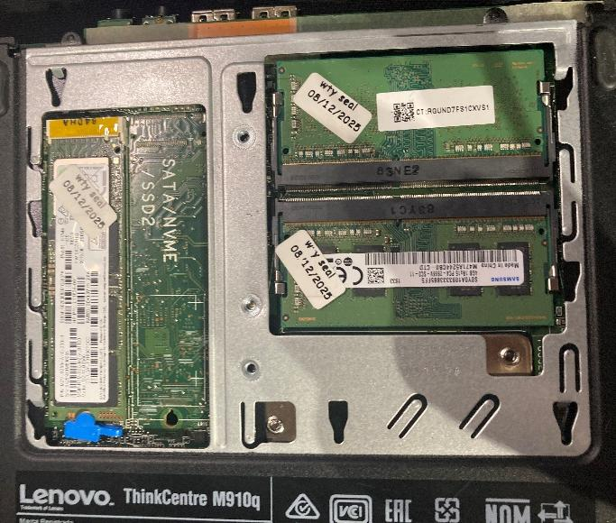 style="width:2.785in;height:2.36736in" />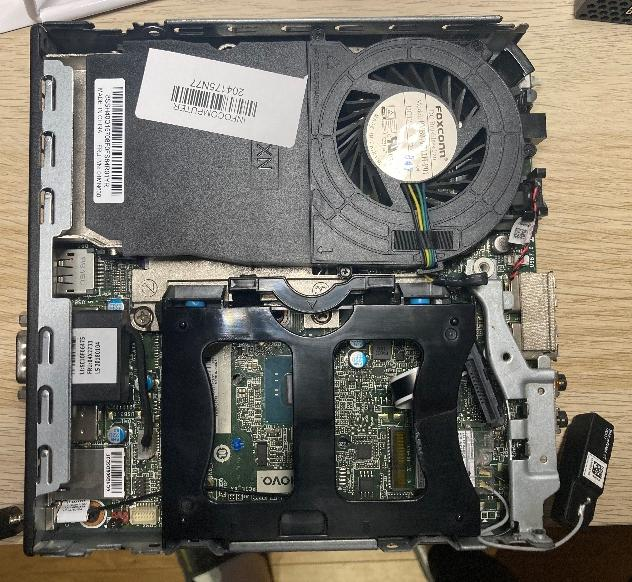 style="width:2.58333in;height:2.37625in" />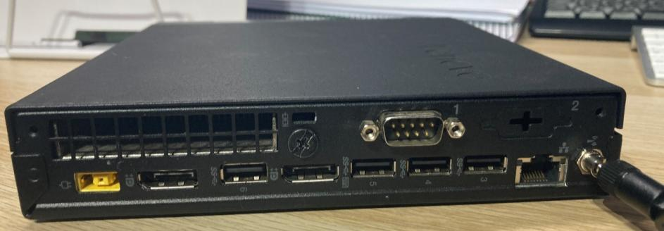 style="width:4.71875in;height:1.64236in" />
>
> Para la implementación del proyecto, se ha optado por una solución
> compacta, pero de alto rendimiento, ideal para entornos de servidores
> domésticos.
>
> **ESPECIFICACIONES** **DEL** **HARDWARE**
>
> Se ha seleccionado un equipo **Lenovo** **ThinkCentre** **M910q**
> **Tiny**, cuyas características técnicas justifican su uso en este
> entorno virtualizado:
>
> ➢**Procesador**: Intel® Core™ i5-6500T (4 núcleos a 2.50 GHz). Su
> soporte para tecnología Intel VT-x es crítico para el funcionamiento
> de Hyper-V.
>
> ➢**Memoria** **RAM**: 8 GB DDR4 *(con* *posibilidad* *de* *ampliación*
> *a* *16* *GB* *mediante* *sus* *dos* *ranuras* *SO-DIMM*). Esta
> cantidad permite una ejecución fluida de Windows 11 y la reserva de
> recursos para la máquina virtual Debian.
>
> ➢**Almacenamiento** **Principal**: Se ha integrado un disco NVMe de
> 256 GB. Esta decisión es clave para el proyecto, ya que reduce
> drásticamente los tiempos de latencia en la lectura/escritura de los
> discos virtuales.
>
> ➢**Almacenamiento** **Secundario** **(Escalabilidad)**: El chasis
> permite la futura incorporación de una unidad SSD/HDD de 2,5" para
> ampliar la capacidad de almacenamiento de datos o copias de seguridad.
>
> ➢**Conectividad** **de** **Red**: Adaptador Gigabit Ethernet
> (10/100/1000 Mbps), esencial para garantizar que el servidor web no
> sufra cuellos de botella en la red local.
>
> *Figura* *1.* *Componentes:* *Disco* *NVME* *y* *Memoria* *RAM*
> *Figura* *2.* *Componentes:* *Disco* *2.5"* *y* *Disipador*
>
> *Figura* *3.* *Componentes:* *Conectores* *Externos* *Traseros*
>
> **3**
>
> **INFRAESTRUCTURA** **DE** **RED** **FÍSICA**
>
> Para asegurar la estabilidad del servicio y evitar las interferencias
> o la latencia propias de las conexiones inalámbricas, se ha optado por
> una conexión cableada:
>
> ➢**Cableado**: Uso de cable de red Categoría 6 UTP, que permite
> velocidades de hasta 1 Gbps y minimiza la diafonía gracias a su
> trenzado de cables.
>
> ➢**Topología**: Conexión directa desde el puerto LAN del router al
> puerto RJ45 del ThinkCentre.
>
> **MONTAJE** **Y** **VERIFICACIÓN**
>
> El proceso de montaje ha consistido en la revisión interna del equipo
> (limpieza de ventilación y comprobación de zócalos) y la conexión de
> periféricos básicos para la configuración inicial. Debido a la
> naturaleza del proyecto, una vez configurado el Acceso Remoto y la
> VPN, el equipo funcionará en modo headless *(sin* *monitor,* *teclado*
> *ni* *ratón* *permanentes)*, maximizando el ahorro energético y
> optimizando el espacio.
>
> **INFRAESTRUCTURA** **DE** **ENERGÍA** **Y** **CONTINUIDAD** **(SAI)**
>
> Para garantizar la Alta Disponibilidad (HA) del servicio y proteger la
> integridad física de los componentes internos ante anomalías
> eléctricas, se han integrado dos unidades **de** **SAI** **Nilox**
> **NXGCLI6001X5V2** **(600VA** **/** **420W)**.
>
> Esta configuración segmentada ofrece las siguientes ventajas técnicas:
>
> ➢**SAI** **1** **-** **Nodo** **de** **Comunicaciones** **(Router)**:
> Garantiza que la conexión a Internet y la red local permanezcan
> activas. Esto es vital para mantener el túnel de la VPN Tailscale y la
> actualización del registro en DuckDNS durante microcortes.
>
> ➢**SAI** **2** **-** **Nodo** **de** **Proceso** **(ThinkCentre**
> **M910q)**: Protege al servidor de apagados bruscos que podrían
> corromper el sistema de archivos de Debian 13 o los discos virtuales
> de Hyper-V. Al ser un equipo de bajo consumo, este SAI ofrece un
> tiempo de autonomía considerable para realizar un apagado controlado
> si fuera necesario.
>
> ➢**Protección** **de** **Hardware**: Ambas unidades actúan como filtro
> ante sobretensiones y picos de voltaje, alargando la vida útil de la
> fuente de alimentación externa del Lenovo y los circuitos del router.
>
> **4**
>
> **FILOSOFÍA** **DE** **ADQUISICIÓN:** **SOSTENIBILIDAD** **Y**
> **EFICIENCIA** **DE** **COSTES**
>
> Para la realización de este proyecto, se ha optado por la adquisición
> de hardware reacondicionado de grado profesional, basando esta
> decisión en tres pilares fundamentales:
>
> 1\. **Economía** **Circular** **y** **Sostenibilidad**: Se busca dar
> una segunda vida útil a equipos de alto rendimiento que aún se
> encuentran en perfectas condiciones técnicas. Esto reduce el impacto
> ambiental y los residuos electrónicos, alineando el proyecto con las
> políticas actuales de Responsabilidad Social Corporativa (RSC).
>
> 2\. **Optimización** **de** **Costes**: El uso de componentes
> reacondicionados permite acceder a hardware de gama empresarial a una
> fracción del coste de un equipo nuevo equivalente. Esto demuestra la
> capacidad del administrador de sistemas para diseñar soluciones
> técnica y económicamente viables.
>
> 3\. **Garantía** **y** **Fiabilidad**: A diferencia del mercado de
> segunda mano convencional, todos los componentes han sido adquiridos a
> través de proveedores que ofrecen garantía técnica, asegurando que el
> equipo ha superado pruebas de estrés y control de calidad antes de su
> implementación.
>
> **PRESUPUESTO** **DE** **LOS** **COMPONENTES** **PARA** **EL**
> **PROYECTO**
>
> *Tabla* *1.* *Presupuesto* *Componentes* *Físicos*

||
||
||
||
||
||
||

> **5**
>
>  style="width:0.77067in;height:0.425in" />**3** **-**
> **<u>Configuración SO Anfitrión:
> Windows</u>**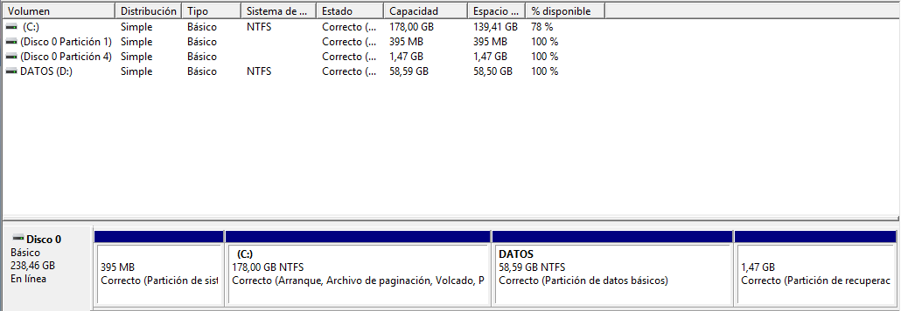 style="width:5.90556in;height:2.04653in" />
>
> Aunque no se mencionó anteriormente, otro de los motivos de la
> elección del equipo ***Lenovo*** ***ThinkCentre*** ***M910q***
> ***Tiny*** es que este cuenta con una clave de producto OEM almacenada
> en la BIOS. Esto permite que, al instalar/reinstalar Windows 11, el
> sistema operativo se active automáticamente sin necesidad de
> introducir la licencia.
>
> Tras la instalación de **Windows** **11** **Pro** *(versión*
> *necesaria* *para* *disponer* *de* *Hyper-V* *de* *forma* *nativa)*,
> se procedió a la optimización del sistema para su rol como servidor
> anfitrión.
>
> **SELECCIÓN** **DE** **NOMBRE** **DE** **EQUIPO**
>
> Se ha modificado el nombre genérico asignado por el instalador por uno
> que siga una nomenclatura profesional. Nombre asignado: VICTOR-SERVER
>
> 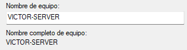 style="width:2.45417in;height:0.6618in" />***Justificación:*** *El*
> *uso* *de* *prefijos* *descriptivos*
>
> *Figura* *4.* *S.O* *Anfitrión:* *Nombre* *del* *equipo*
>
> *(SERVER* *para* *el* *servidor)* *facilita* *la* *identificación*
> *del* *nodo* *dentro* *de* *la* *red* *local* *y* *en* *el* *panel*
> *de* *control* *de* *la* *VPN* *Tailscale,* *siguiendo* *buenas*
> *prácticas* *de* *administración* *de* *sistemas.*
>
> **ADMINISTRACIÓN** **DE** **DISCOS**
>
> Dado que el equipo cuenta con una **unidad** **NVMe** **de** **256**
> **GB**, la estructura de particiones se ha diseñado para maximizar su
> eficiencia:
>
> ▪ **Partición** **de** **Sistema** **(C:)**: Destinada exclusivamente
> al SO anfitrión y binarios de Hyper-V. **178,00** **GB.**
>
> ▪ **Partición** **DATOS** **(D:)**: Destinada a almacenar los datos,
> así como a la sincronización con una nube privada *(Nextcloud)*.
> **58,59** **GB.**
>
> En ambas particiones se ha seleccionado un sistema de archivos NTFS
> con un tamaño de unidad de asignación estándar, asegurando la
> compatibilidad con los archivos de disco virtual. La cantidad de
> espacio elegido para las particiones de este proyecto es razonable,
> evitando un llenado que podría generar inestabilidad.
>
> *Figura* *5.* *S.O* *Anfitrión:* *Administrador* *de* *Discos*
>
> **6**

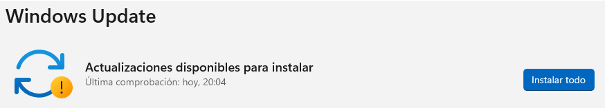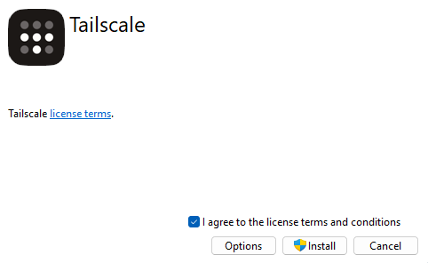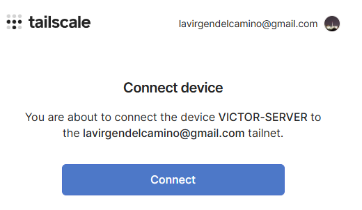

> **ACTUALIZACIONES** **DE** **SEGURIDAD**
>
> Antes de instalar roles y características, se garantizó la integridad
> del sistema:
>
> ▪ **Windows** **Update**: Ejecución de todos los ciclos de
> actualización para cubrir parches de día cero y actualizaciones del
> procesador i5-6500T.
>
> ▪ **Drivers** **específicos**: Revisión de los controladores de
> chipset de Lenovo para asegurar la estabilidad del equipo.
>
> *Figura* *6.* *S.O* *Anfitrión:* *Actualizaciones* *de* *Windows*
>
> **CONFIGURACIÓN** **DE** **ACCESO** **REMOTO**
>
> Para permitir una gestión sin monitor, se implementó una doble capa de
> acceso: **-** **Instalación** **y** **Configuración** **del**
> **Servicio** **VPN** **Tailscale** **-**
>
> Se ha implementado Tailscale como solución de red privada virtual
> (VPN) basada en el protocolo WireGuard.
>
> ❖**Función**: Crea una malla segura entre el servidor y los
> dispositivos de administración.
>
> ❖**Ventaja** **técnica**: Permite acceder al servidor desde cualquier
> red externa sin necesidad de abrir puertos peligrosos en el router
> hacia el anfitrión.
>
> *Figura* *7.* *S.O* *Anfitrión:* *Instalación* *Tailscale* *Figura*
> *8.* *S.O* *Anfitrión:* *Conexión* *dispositivo* *a* *la* *VPN*
>
> *Figura* *9.* *S.O* *Anfitrión:* *Equipos* *de* *la* *red* *VPN*
>
> **7**

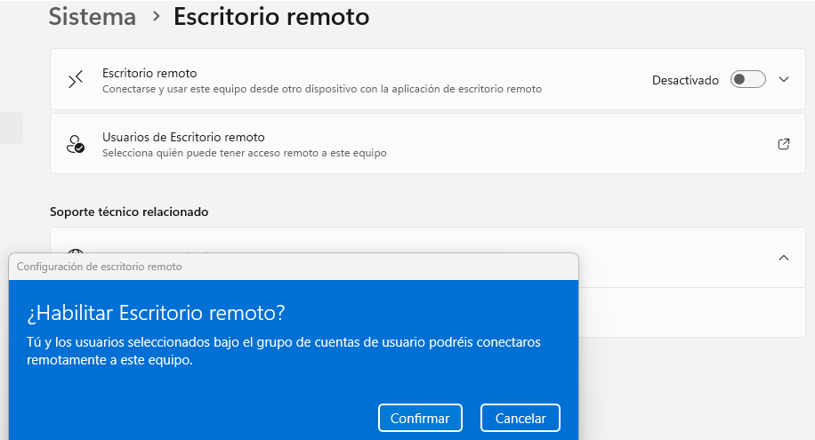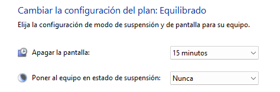

> **-** **Configuración** **del** **Servicio** **de** **Escritorio**
> **de** **Remoto** **-**
>
> Se ha activado el Escritorio Remoto de Windows para la gestión gráfica
> del anfitrión.
>
> Filtrado: Gracias a Tailscale, el acceso RDP solo está disponible a
> través de la interfaz virtual de la VPN, quedando totalmente oculto e
> inaccesible para cualquier usuario en la red pública de Internet.
>
> *Figura* *10.* *S.O* *Anfitrión:* *Habilitar* *Escritorio* *Remoto*
>
> **OTRAS** **CONFIGURACION**
>
> **-** **Configuración** **de** **Energía** **-**
>
> Se ha establecido una configuración de energía adecuada, para que el
> equipo no entre en suspensión.
>
> *Figura* *11.* *S.O* *Anfitrión:* *Configuración* *de* *Energía*
>
> **-** **Configuración** **del** **Servicio** **de** **Escritorio**
> **de** **Remoto** **-**
>
> Se ha establecido una configuración estática inicial para evitar
> conflictos:
>
> 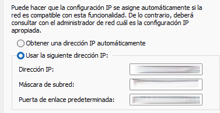 style="width:2.83889in;height:1.45972in" />***IP*** ***Privada:***
> *Asignación* *de* *una* *IP* *para* *asegurar* *que* *los* *servicios*
> *de* *gestión* *local* *sean* *siempre* *localizables.*
>
> ***Interfaz:*** *Verificación* *de* *la* *conexión* *mediante* *el*
> *cable* *Cat* *6* *para* *garantizar* *el*
>
> *ancho* *de* *banda* *necesario* *para* *el* *servidor* *Figura* *12.*
> *S.O* *Anfitrión:* *Configuración* *de* *Red* *Apache* *que* *correrá*
> *en* *la* *máquina* *virtual.*
>
> **8**

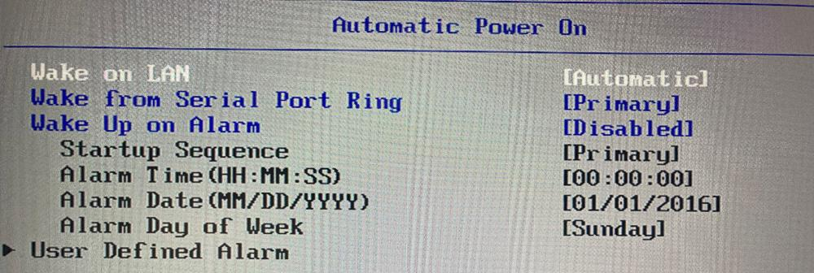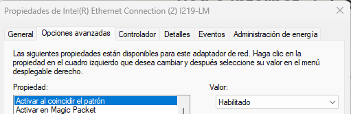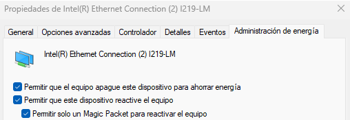

> **-** **Configuración** **WOL:** **Wake** **on** **LAN** **-**
>
> Con el objetivo de maximizar la eficiencia energética y permitir la
> gestión del servidor en escenarios de apagado, se ha implementado la
> **tecnología** **Wake** **on** **LAN**. Esto permite arrancar el
> equipo de forma remota mediante el envío de un paquete especial
> *(Magic* *Packet)* a través de la red local.
>
> 1\) **Configuración** **a** **nivel** **de** **Firmware** **(BIOS)**:
> Se accedió a la configuración de energía de la placa base para
> habilitar la característica Wake on LAN. Esto mantiene latarjeta de
> red enunestado de bajo consumo, ala escucha de señales de activación
> incluso con el sistema operativo apagado.
>
> *Figura* *13.* *S.O* *Anfitrión:* *Configuración* *BIOS* *para* *uso*
> *tecnología* *WOL*
>
> 2\) **Configuración** **de** **la** **Interfaz** **de** **Red** **en**
> **Windows** **11**: Para que el sistema operativo Windows 11 no
> desactive la funcionalidad para ahorrar energía, se realizaron los
> siguientes ajustes:
>
> ➔***Propiedades*** ***Avanzadas**:* *Se* *activaron* *las* *funciones*
> *‘Coincidir* *con* *el* *patrón’* *y* *‘Magic* *Packet’.*
>
> *Figura* *14.* *S.O* *Anfitrión:* *Habilitar* *Opciones* *de* *Red*
> *para* *WOL*
>
> ➔***Administración*** ***de*** ***Energía**:* *Se* *marcó* *la*
> *opción* *"Permitir* *que* *este* *dispositivo* *reactive* *el*
> *equipo",* *asegurando* *que* *la* *controladora* *Ethernet* *actúe*
> *como* *disparador* *del* *encendido* *al* *recibir* *el* *paquete*
> *de* *datos* *específico.*
>
> *Figura* *15.* *S.O* *Anfitrión:* *Permitir* *'Magic* *Packet'* *para*
> *reactivar* *el* *equipo*
>
> **9**
>
>  style="width:0.77067in;height:0.425in" />**4** **-** **<u>Entorno
> Virtualizado</u>**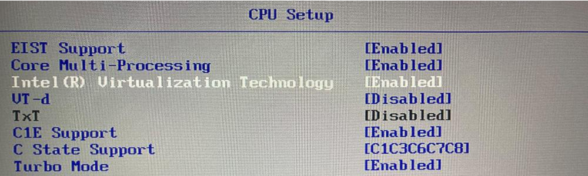 style="width:5.86042in;height:1.75972in" />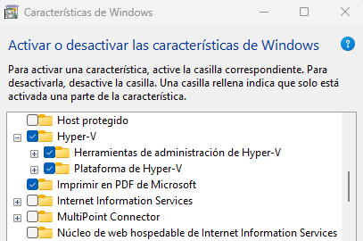 style="width:3.0775in;height:2.04514in" />
>
> En este apartado se detalla la transformación del equipo físico en un
> servidor de virtualización mediante la tecnología de Microsoft.
>
> **ACTIVACIÓN** **DE** **LA** **TECNOLOGÍA** **DE** **VIRTUALIZACIÓN**
> **EN** **LA** **BIOS**

Para que el hipervisor tenga acceso directo a las capacidades del
hardware, es imprescindible habilitar las extensiones de virtualización
del procesador Intel i5-6500T.

> ❖Parámetro habilitado: **Intel** **Virtualization** **Technology**,
> que permite al procesador funcionar como varios procesadores lógicos.
>
> *Figura* *16.* *Entorno* *Virtualizado:* *Activar* *Tecnología* *de*
> *Virtualización* *en* *BIOS*
>
> **INSTALACIÓN** **DE** **LA** **CARACTERÍSTICA** **HYPER-V**
>
> Una vez preparado el hardware, se procedió a la instalación del rol de
> hipervisor en Windows 11 Pro:
>
> ❖Método: *A* *través* *de* *"Activar* *o* *desactivar* *las*
> *características* *de* *Windows".*
>
> ❖Componentes instalados:
>
> o ***Plataforma*** ***de*** ***Hyper-V:*** *El* *motor* *del*
> *hipervisor.*
>
> o ***Herramientas*** ***de*** ***administración*** ***de***
> ***Hyper-V:*** *Consola* *gráfica* *(Administrador* *de* *Hyper-V)*
> *y* *el* *módulo* *para* *PowerShell.*
>
> Resultado: Tras reiniciar, el SOanfitrión se convierte en la
> ***"Partición*** ***Parent"***, encargada de gestionar el acceso al
> hardware para el resto de máquinas virtuales.
>
> *Figura* *17.* *Entorno* *Virtualizado:* *Activar* *característica*
> *Hyper-V* *en* *anfitrión*
>
> **10**

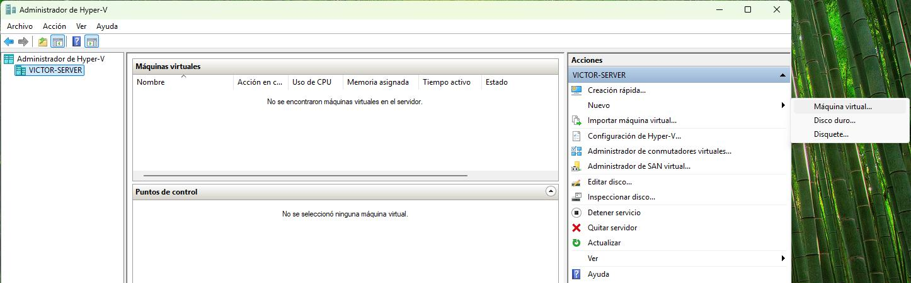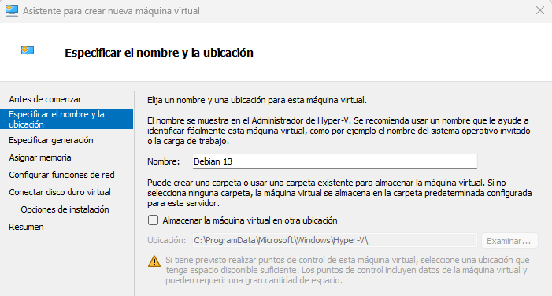

> **CONFIGURACIÓN** **DEL** **ENTORNO** **VIRTUALIZADO**
>
> Antes de crear la VM, se preparó el entorno de red virtual: **-**
> **Creación** **de** **Conmutadores** **Virtuales** **(Switches)**
> **-**
>
> Se configuró inicialmente un Conmutador Interno para permitir la
> comunicación segura entre el anfitrión (Windows) y el invitado
> (Debian) sin exposición externa inmediata.
>
> Se verificó la asignación de memoria dinámica para permitir que el
> hipervisor gestione la RAM de forma eficiente según la carga del
> servidor web.
>
> **CREACIÓN** **DE** **LA** **MÁQUINA** **VIRTUAL**
>
> *Figura* *18.* *Entorno* *Virtualizado:* *Creación* *Máquina*
> *Virtual* *en* *Administrador* *de* *Hyper-V*
>
> *Figura* *19.* *Entorno* *Virtualizado:* *Asignación* *Nombre* *de*
> *la* *Máquina* *Virtual*
>
> **11**

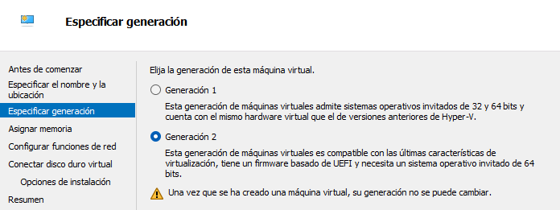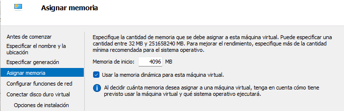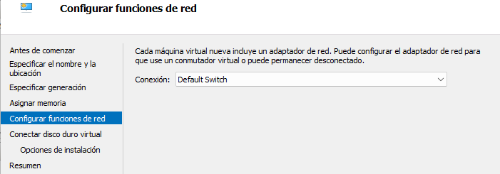

> Se procedió al despliegue de la VM siguiendo estas especificaciones
> técnicas:
>
> **-** **Especificar** **Generación:** **Generación** **2** **-**
>
> Justificación: Ofrece soporte para arranque seguro (Secure Boot),
> firmware basado en UEFI y mayor rendimiento al eliminar la emulación
> de hardware heredado (legacy).
>
> *Figura* *20.* *Entorno* *Virtualizado:* *Elección* *de* *Generación*
> *2* *(UEFI)*
>
> **-** **Asignación** **de** **Memoria** **-**
>
> RAM: **4GB** **con** **memoria** **dinámica** **activada**.
>
> *Figura* *21.* *Entorno* *Virtualizado:* *Asignación* *Memoria*
> *Dinámica*
>
> **-** **Configuración** **de** **Funciones** **de** **Red**
> **-**Conexión: **Default** **Swith**.
>
> *Figura* *22.* *Entorno* *Virtualizado:* *Configuración* *de* *Red*
> *Inicial* *en* *el* *Entorno* *Virtualizado*
>
> **12**

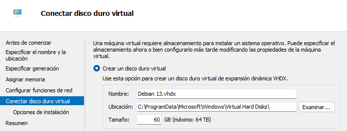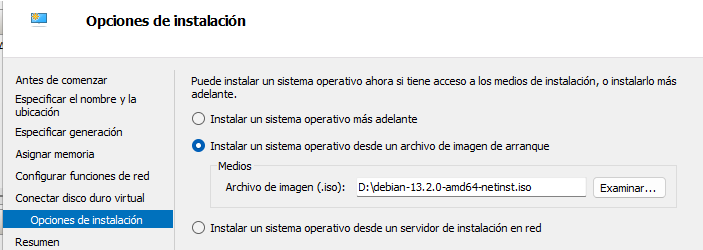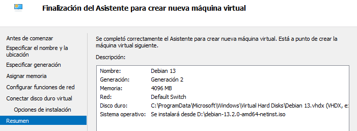

> **-** **Conectar** **Disco** **Duro** **Virtual** **-**
>
> Disco Duro Virtual: *Archivo* *.vhdx* de expansión dinámica almacenado
> en la unidad NVMe. **60,00** **GB**.
>
> *Figura* *23.* *Entorno* *Virtualizado:* *Conexión* *de* *Disco*
> *Duro* *Virtual*
>
> **-** **Opciones** **de** **Instalación** **-**
>
> Selección del medio de instalación del sistema operativo que acogerá
> la máquina virtual: **Archivo** **de** **Imagen** **de** **Arranque**
> **de** **Debian** **13**.
>
> *Figura* *24.* *Entorno* *Virtualizado:* *Selección* *de* *Imagen*
> *ISO* *para* *instalación* *Debian* *13*
>
> **-** **Resumen** **-**
>
> *Figura* *25.* *Entorno* *Virtualizado:* *Finalización* *Creación*
> *Máquina* *Virtual*
>
> **13**

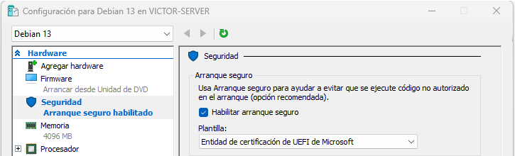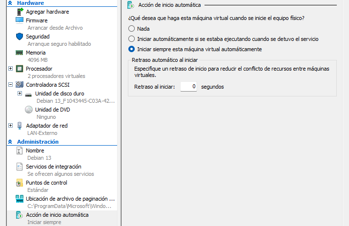

> **CONFIGURACIÓN** **DE** **SEGURIDAD**
>
> Para garantizar un entorno robusto, se aplicó la directiva de
> seguridad ***Secure*** ***Boot,*** activada con la plantilla
> ***"Microsoft*** ***UEFI*** ***Certificate*** ***Authority"*** para
> permitir que Debian 13 arranque de forma segura.
>
> *Figura* *26.* *Entorno* *Virtualizado:* *Configuración* *de*
> *Seguridad* *Entorno* *Virtualizado*
>
> **CONFIGURACIÓN** **DE** **INICIO** **AUTOMÁTICO**

Como parte delaestrategia paragarantizar que elservidorwebesté
disponibledeforma ininterrumpida, se ha configurado la política de
Acción de inicio automática en Hyper-V.

> ❖**Configuración** **aplicada**: Se ha seleccionado la opción
> ***"Iniciar*** ***siempre*** ***esta*** ***máquina*** ***virtual***
> ***automáticamente"***.
>
> ❖**Justificación** **técnica**: Esta directiva asegura que, en caso de
> un reinicio del sistema operativo anfitrión *(por* *actualizaciones*
> *críticas* *o* *mantenimiento)* o tras una recuperación de energía, la
> máquina virtual con Debian 13 arranque de forma autónoma sin
> intervención humana.
>
> ❖**Optimización** **de** **Recursos**: Se ha establecido un retraso de
> inicio de 0 segundos, ya que, al ser el único servicio crítico del
> nodo, se prioriza su disponibilidad inmediata sobre el host
> VICTOR-SERVER.
>
> *Figura* *27.* *Entorno* *Virtualizado:* *Configuración* *Arranque*
> *Automático*
>
> **14**
>
>  style="width:0.77067in;height:0.425in" />**5** **-**
> **<u>Configuración S.O. Invitado: Debian
> 13</u>**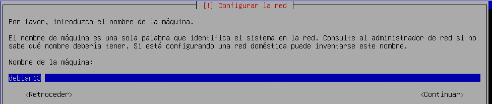 style="width:5.9043in;height:1.24514in" />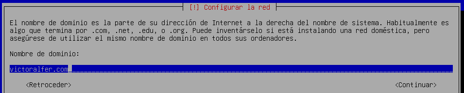 style="width:5.90264in;height:1.18958in" />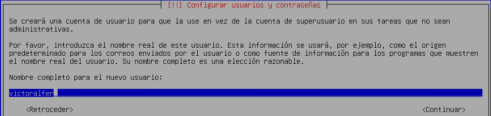 style="width:5.90542in;height:1.40486in" />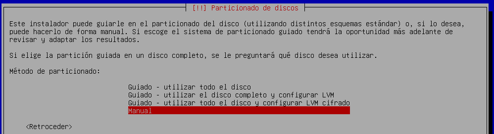 style="width:5.90194in;height:1.60069in" />
>
> Antes de iniciar la instalación, es importante añadir quela elección
> de **Debian** **13** se debe a la necesidad de contar con lasversiones
> más recientes de paquetes como Apache 2.4.x y las últimas librerías de
> seguridad, lo que garantiza una mayor compatibilidad con las funciones
> modernas de HTML5 y CSS3.
>
> La instalación comenzará indicando:
>
> ❖Nombre de equipo: ***debian13***
>
> ❖Nombre de dominio: ***victoralfer.com*** *(opcional)* ❖Nombre
> completo del usuario: ***victoralfer*** ❖Tipo de Instalación:
> ***Manual***
>
> *Figura* *28.* *Instalación* *Debian* *13:* *Nombre* *del* *equipo*
>
> *Figura* *29.* *Instalación* *Debian* *13:* *Nombre* *del* *dominio*
>
> *Figura* *30.* *Instalación* *Debian* *13:* *Nombre* *del* *usuario*
>
> *Figura* *31.* *Instalación* *Debian* *13:* *Tipo* *de* *Instalación*
> *-* *Manual*
>
> **15**

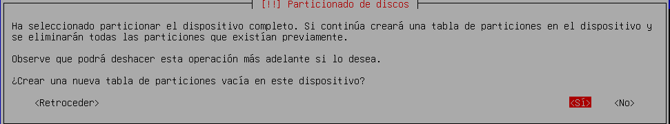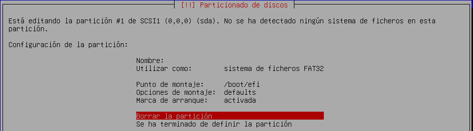

> **CREACIÓN** **DE** **LA** **TABLA** **DE** **PARTICIONES**

Para este proyecto, se ha optado por un esquema de particionado manual
sobre el disco virtual NVMe de 256 GB, buscando un equilibrio entre
simplicidad y seguridad de datos:

> ❖**Partición** **EFI** **(/boot/efi)**: **499,1MB**. Necesaria para el
> arranque en modo Generación 2 (UEFI). El sistema de archivos elegido
> es FAT32, que es el requerido por el Firmware.
>
> ❖**Partición** **Raíz** **(/)**: **35,00GB**. Se utiliza el sistema de
> archivos ext4 por su estabilidad probada en entornos de producción
> Linux.
>
> ❖**Área** **de** **Intercambio** **(SWAP)**: **8** **GB**. Configurada
> para dar soporte a la memoria RAM en picos de carga del servidor
> Apache. Es recomendable establecer el doble de la memoria RAM con la
> que cuenta la máquina virtual.
>
> ❖**DirectoriosPersonales** **(/home)**: **20,9** **GB**.Configurada
> paraubicar losdirectorios personales de todos los usuarios del sistema
> operativo, a excepción del superusuario ‘root’. El sistema de archivos
> elegido es ext4.
>
> *Figura* *32.* *Instalación* *Debian* *13:* *Creación* *Tabla* *de*
> *Particiones*
>
> *Figura* *33.* *Instalación* *Debian* *13:* *Creación* *de* *la*
> *Partición* *EFI*
>
> *Figura* *34.* *Instalación* *Debian* *13:* *Creación* *de* *la*
> *Partición* *Principal*
>
> **16**

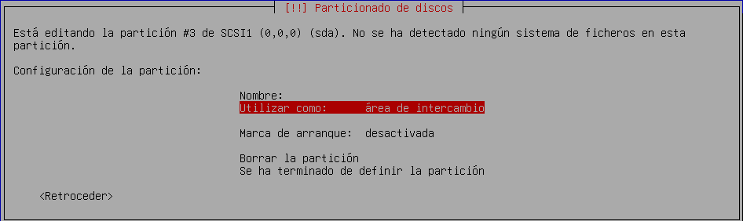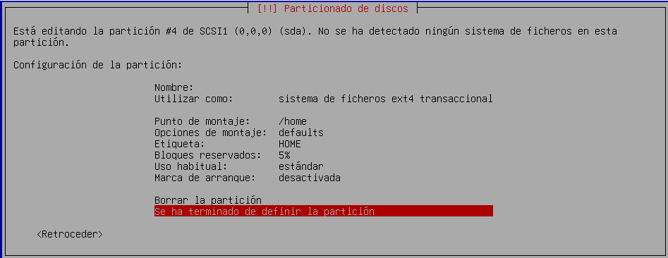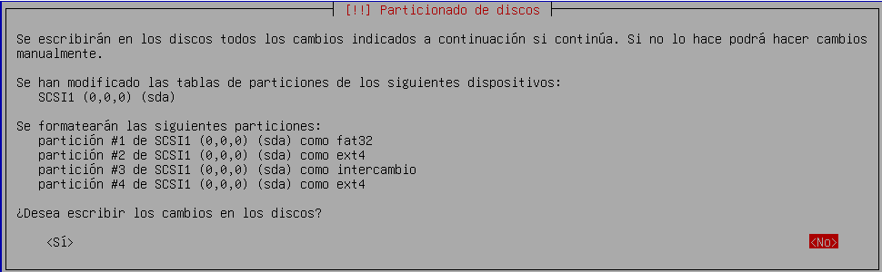

> *Figura* *35.* *Instalación* *Debian* *13:* *Creación* *Partición*
> *SWAP*
>
> *Figura* *36.* *Instalación* *Debian* *13:* *Creación* *Partición*
> *de* *Directorios* *Personales*
>
> *Figura* *37.* *Instalación* *Debian* *13:* *Confirmación* *de* *la*
> *Creación* *de* *las* *Particiones*
>
> **17**

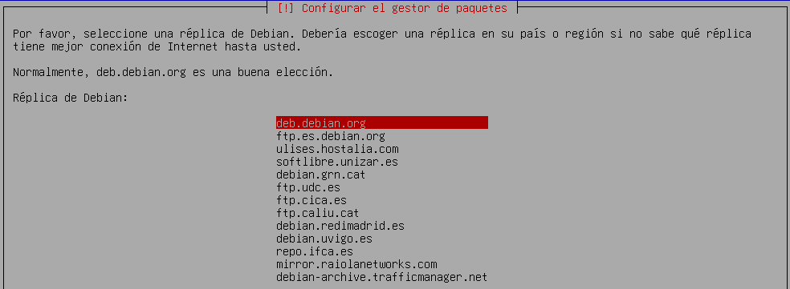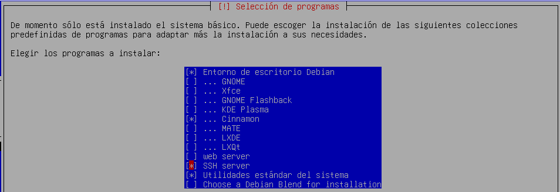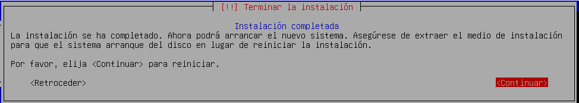

> **SELECCIÓN** **DE** **REPOSITORIOS** **Y** **CARACTERÍSTICAS**
>
> Durante el proceso de instalación, se tomaron decisiones críticas para
> mantener el servidor optimizado:
>
> ❖**Gestor** **de** **Paquetes**: Se seleccionó la opción
> predeterminada **“*deb.debian.org***”, porque incluye todos los
> paquetes a los que optaremos en este proyecto.
>
> ❖**Entorno** **de** **Escritorio**: Se ha optado por el entorno de
> escritorio ***“Cinnamon”***, que es el más “parecido” a Windows.
> Aunque toda la configuración se realizará mediante terminal, es una
> opción interesante si en alguna ocasión puntual se tuviera que
> modificar alguno de los ficheros *(html,* *css* *o* *js)* de la web
> alojada, con programas como SublimeText.
>
> ❖**Utilidades** **del** **sistema**: Se seleccionaron únicamente
> ***"Utilidades*** ***estándar*** ***del*** ***sistema"*** y el
> servidor ***"SSH*** ***server"*** para permitir laadministración
> remota desde el anfitrión.
>
> *Figura* *38.* *Instalación* *Debian* *13:* *Configuración* *Gestor*
> *de* *Paquetes*
>
> *Figura* *39.* *Instalación* *Debian* *13:* *Selección* *de*
> *Programas* *a* *Instalar*
>
> *Figura* *40.* *Instalación* *Debian* *13:* *Finalizar* *Instalación*
>
> **18**

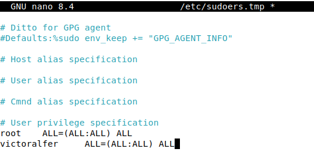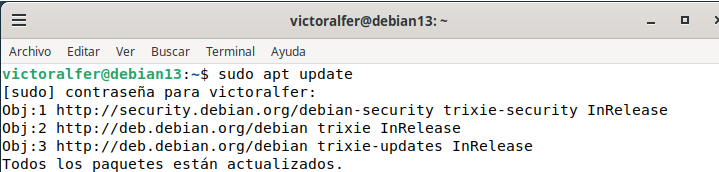

> **CONFIGURACIÓN** **DE** **DEBIAN** **13**
>
>  style="width:0.13819in;height:0.13889in" />**Privilegios** **de**
> **Usuario**
>
> Para la gestión de permisos administrativos, se ha optado por una
> configuración granular en lugar de compartir la cuenta de
> superusuario.
>
> **--** **Uso** **de** **Visudo** **--**
>
> Se utilizó el comando sudo visudo para editar de forma segura el
> archivo /etc/sudoers.
>
> ***Justificación**:* *El* *uso* *de* *visudo* *es* *una* *práctica*
> *recomendada* *en* *administración* *de* *sistemas,* *yaque* *bloquea*
> *el* *archivocontraediciones* *simultáneas* *y* *realizaunavalidación*
> *de* *sintaxis* *antes* *de* *guardar* *los* *cambios,* *evitando*
> *que* *el* *sistema* *quede* *bloqueado* *por* *un* *error*
> *tipográfico.*
>
> **--** **Asignación** **de** **Permisos** **--**
>
> Como se observa en la configuración realizada *(ver* *captura* *de*
> *pantalla)*, se otorgaron privilegios totales al usuario
> ***victoralfer*** bajo la ***directiva*** ***ALL=(ALL:ALL)***
> ***ALL***, permitiéndole ejecutar cualquier comando en cualquier
> terminal tras la autenticación.
>
> *Figura* *41.* *Configuración* *Debian* *13:* *Asignación* *de*
> *Permisos* *Usuarios*
>
>  style="width:0.13819in;height:0.13819in" />**Actualización** **de**
> **Listado** **de** **Paquetes**
>
> Nada más concluir la instalación, se sincronizaron los índices de los
> repositorios oficiales de Debian para garantizar que el software de
> base esté al día:
>
> *Figura* *42.* *Configuración* *Debian* *13:* *Actualización* *de*
> *Paquetes*
>
> **19**

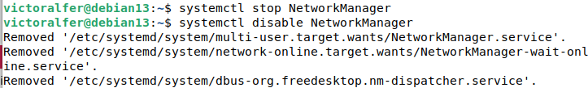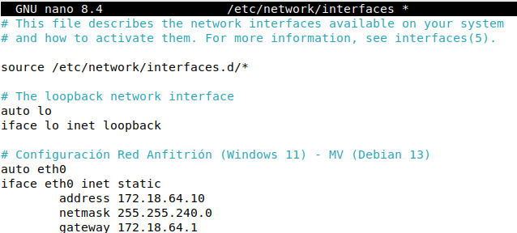

>  style="width:0.13819in;height:0.13819in" />**Configuración** **de**
> **Red** **Interna** **con** **Equipo** **Anfitrión**
>
> Para asegurar una comunicación fluida y privada entre Windows 11 y
> Debian 13 antes de salir a Internet, se configuró la interfaz de red
> interna:
>
> I. **Servicio** **NetworkManager:** *Se* *procedió* *a* *detener* *y*
> *deshabilitar* *el* *servicio* ***NetworkManager**,* *asociado* *a*
> *la* *configuración* *de* *red* *a* *través* *del* *entorno* *gráfico*
> *de* *Debian,* *para* *que* *este* *servicio* *no* *interfiera* *en*
> *la* *configuración* *que* *se* *realice* *desde* *la* *terminal.*
>
> II\. **Configuración** **Interfaz** **de** **Red**: *Se* *fijó* *una*
> *configuración* *estática* *para* *la* *interfaz* ***eth0*** *que*
> *permitirá* *comunicar* *de* *una* *manera* *eficiente* *y* *directa*
> *con* *el* *SO* *Anfitrión* *a* *través* *de* *la* *red* *interna*
> *entre* *ambos.* *Toda* *esta* *configuración* *se* *realizó* *en*
> *el* *archivo* ***/etc/network/interfaces**.*
>
> o ***Dirección*** ***de*** ***Red:*** ***172.18.64.0/20***
>
> o ***Dirección*** ***IP*** ***Anfitrión*** ***(Windows*** ***11):***
> ***172.18.64.1*** o ***Dirección*** ***IP*** ***Invitado***
> ***(Debian*** ***13):*** ***172.18.64.10***
>
> *El* ***uso*** ***una*** ***dirección*** ***de*** ***red*** ***con***
> ***una*** ***máscara*** ***/20*** *y* *no* *con* *una* *máscara*
> */24,* *se* *debe* *a* *que* *de* *manera* *automática* *Hyper-V*
> *genera* *este* *tipo* *de* *direcciones* *para* *la* *conectividad*
> *entre* *Anfitrión* *e* *Invitado.* *No* *se* *le* *dio* *mayor*
> *importancia* *ya* *que,* ***esta*** ***configuración*** ***es***
> ***provisional*** *y* *sólo* *se* *mantendrá* *mientras* *se*
> *‘blinda’* *el* *Entorno* *Virtualizado* *completo* *antes* *de*
> *salir* *a* *Internet.*
>
> *Figura* *43.* *Configuración* *Debian* *13:* *Configuración* *de*
> *Interfaz* *de* *Red*
>
> *III.* **Prueba** **de** **conectividad**: *Se* *realizaron* *pruebas*
> *de* *ping* *bidireccionales* *para* *confirmar* *que* *el*
> *anfitrión* *puede* *acceder* *al* *servidor* *web* *que* *se*
> *instalará* *a* *continuación.*
>
> **20**
>
>  style="width:0.77067in;height:0.425in" />**6** **-** **<u>Instalación
> Servidor Web Apache</u>**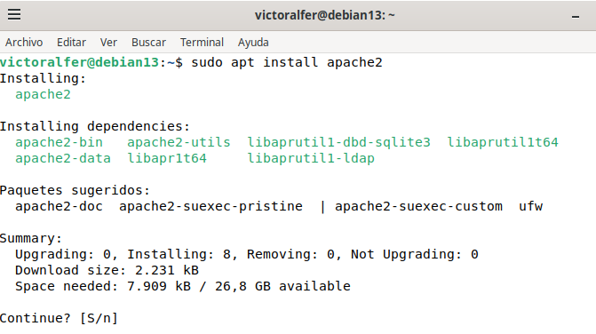 style="width:5.71597in;height:3.20111in" />
>
> El servidor web Apache ha sido el elegido para este proyecto por su
> flexibilidad, gran documentación y estabilidad en sistemas basados en
> Unix.
>
> **INSTALACIÓN** **DESDE** **LOS** **REPOSITORIOS** **OFICIALES**
>
> La instalación se realiza mediante el gestor de paquetes ***apt***,
> asegurando la obtención de la versión estable más reciente y sus
> dependencias de seguridad.
>
> **Comando** **de** **instalación**: ***sudo*** ***apt***

||
||
||

> *Figura* *44.* *Servidor* *Web* *Apache:* *Instalación*
>
> **Verificación** **del** **servicio**: Una vez finalizado el proceso,
> se comprueba que el demonio esté corriendo correctamente con el
> comando ***systemctl*** ***status*** ***apache2***.
>
> **CONFIGURACIÓN** **DEL** **SITIO** **QUE** **ALOJARÁ** **LA**
> **PÁGINA** **WEB**
>
> Para una administración limpia, se evita modificar la configuración
> global de Apache. En su lugar, se crea un Virtual Host específico para
> el proyecto.
>
> **-** **Archivo** **de** **Configuración** **del** **Sitio** **-**
>
> Se genera el fichero
> ***/etc/apache2/sites-available/web-apuntes.conf***. Dentro de este,
> se definen parámetros críticos:
>
> ❖**DocumentRoot**: Se estableció la ruta absoluta ***/var/www/html***
> como directorio raíz donde el servidor buscará los ficheros de la
> página web.
>
> ❖**ServerAdmin**: Se configuró el correo ***webmaster@localhost***
> para el reporte de posibles errores del servidor.
>
> ❖**ServerName**: Se asignó el dominio ***victoralfer.duckdns.org***,
> que será el nombre de dominio dinámico utilizado para acceder desde el
> exterior.
>
> ❖**Logs**: Se configuraron las rutas de los registros de errores y de
> acceso.
>
> **21**

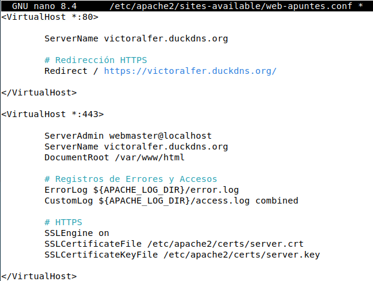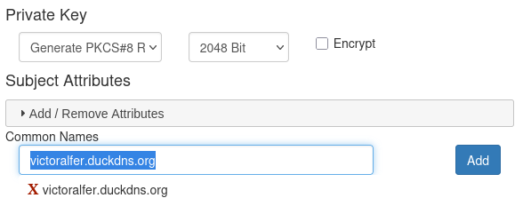

> ❖**SSLEngine**: Activar Protocolo SSL
>
> ❖**SSLCertificateFile**: Fichero con Certificado Autofirmado
> ❖**SSLCertificateKeyFile**: Fichero con Clave Privada
>
> ❖**Redirect**: Redirección para abrir siempre la web con protocolo
> HTTPS
>
> *Figura* *45.* *Servidor* *Web* *Apache:* *Creación* *del* *Sitio*
>
> **GENERADOR** **DE** **CERTIFICADO** **AUTOFIRMADO** **PARA** **EL**
> **SITIO**
>
> Para generar un **Certificado** **Autofirmado** para el sitio, se ha
> utilizado la web **CertificateTools.com**, que es una plataforma web
> especializada en la gestión y generación de certificados digitales
> (SSL/TLS) y herramientas de criptografía.
>
> *Figura* *46.* *Generación* *Certificado* *Autofirmado* *-*
> *Dirección*
>
> **22**

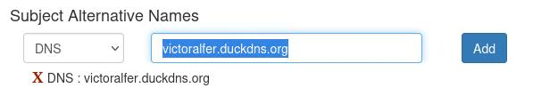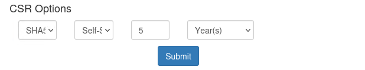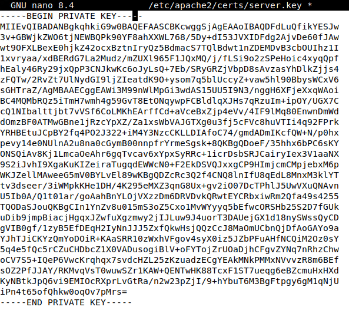

> *Figura* *47.* *Generación* *Certificado* *Autofirmado* *-* *DNS*
>
> *Figura* *48.* *Generación* *Certificado* *Autofirmado* *-* *Cifrado*
>
> 1\) Creación de **Fichero** **de** **Clave** **Privada** con código
> extraído de **CertificateTools.com**
>
> *Figura* *49.* *Generación* *Certificado* *Autofirmado* *-* *Creación*
> *Clave* *Privada*
>
> **23**

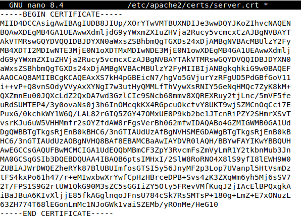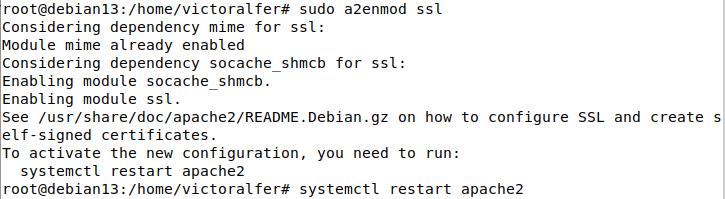

> 2\) Creación de **Fichero** **con** **Certificado** con código
> extraído de **CertificateTools.com**
>
> *Figura* *50.* *Generación* *Certificado* *Autofirmado* *-* *Creación*
> *Clave* *Pública*
>
> **ACTIVACIÓN** **MÓDULO** **SSL** **EN** **SERVIDOR** **WEB**
> **APACHE**
>
> Será necesario **activar** **el** **módulo** **SSL** en el
> **Servidor** **Web** **Apache** para poner utilizar las directivas
> relacionadas con este protocolo en nuestro sitio.
>
> *Figura* *51.* *Servidor* *Web* *Apache:* *Activar* *Módulo* *SSL*
>
> **24**

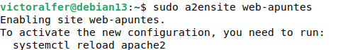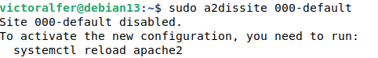

> **ACTIVACIÓN** **DEL** **SITIO**
>
> Con el archivo de configuración preparado, se procede a su puesta en
> marcha utilizando las herramientas propias de Apache:
>
> **-** **Habilitar** **el** **nuevo** **sitio** **-**
>
> Se utiliza el comando **sudo** ***a2ensite*** ***web-apuntes***, el
> cual crea un enlace simbólico en el directorio sites-enabled.
>
> *Figura* *52.* *Servidor* *Web* *Apache:* *Activación* *del* *Sitio*
>
> **-** **Deshabilitar** **el** **sitio** **predeterminado** **-**
>
> Para evitar conflictos de visualización, se ejecuta ***sudo***
> ***a2dissite*** ***000-default***.
>
> *Figura* *53.* *Servidor* *Web* *Apache:* *Deshabilitar* *Sitio*
> *Predeterminado*
>
> **-** **Recarga** **del** **Servicio** **-**
>
> Se aplica la nueva configuración con ***sudo*** ***systemctl***
> ***reload*** ***apache2***, lo que permite que los cambios entren en
> vigor sin interrumpir las conexiones activas.
>
> **25**
>
>  style="width:0.77067in;height:0.425in" />**7** **-** **<u>Instalación
> y Configuración SMB/CIFS</u>**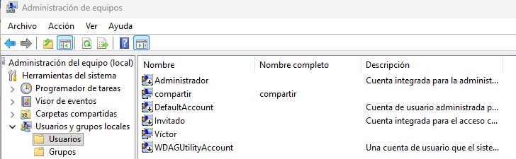 style="width:5.90556in;height:1.825in" />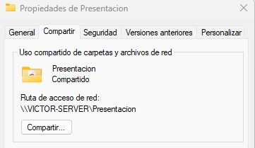 style="width:2.74681in;height:1.59028in" />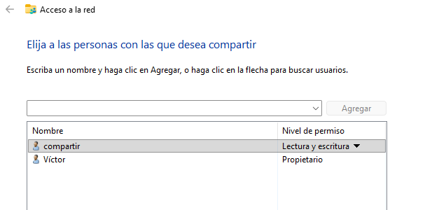 style="width:3.21736in;height:1.59028in" />
>
> Para agilizar el flujo de trabajo, se ha implementado un sistema de
> archivos compartido que permite al administrador editar el código de
> la página web desde las herramientas nativas de Windows 11 y poder
> acceder a esos ficheros desde la máquina virtual con Debian.
>
> No se ha querido que la carpeta compartida coincidiera con la ruta que
> acoge el ***sitio*** ***web-apuntes*** en el Servidor Web Apache, para
> evitar que se publique contenido no deseado. Es bien sabido que cuando
> se editan ficheros relacionados con la estructura, el estilo o el
> dinamismo de una página web; se pueden realizar múltiples
> modificaciones hasta lograr un resultado que satisfaga al diseñador
> web.
>
> **CONFIGURACIÓN** **DE** **CARPETA** **COMPARTIDA** **EN** **WINDOWS**
> **11**
>
> En el equipo anfitrión (VICTOR-SERVER), se preparó el recurso
> compartido:
>
> **-** **Creación** **usuario** **específico** **-**
>
> Se optó por la creación del usuarioespecífico***“compartir”*** para
> compartircarpetasentre el equipo anfitrión y el invitado. La creación
> de dicho usuario, así como la fijación de su contraseña, se realizó
> desde el **Administrador** **de** **Equipos** de Windows 11.
>
> *Figura* *54.* *Configuración* *SMB/CIFS:* *Creación* *Usuario*
> *específico*
>
> **-** **Creación** **del** **Directorio** **-**
>
> Se creó la carpeta dedicada en la siguiente ruta:
> ***D:\Presentación*** **-** **Permisos** **para** **Compartir** **-**
>
> Se habilitó el **protocolo** **SMB** para esta carpeta, asignando
> permisos de Lectura y Escritura al usuario “***compartir”*** del
> equipo anfitrión.
>
> *Figura* *55.* *Configuración* *SMB/CIFS:* *Compartir* *Carpeta* *en*
> *equipo* *anfitrión*
>
> **26**

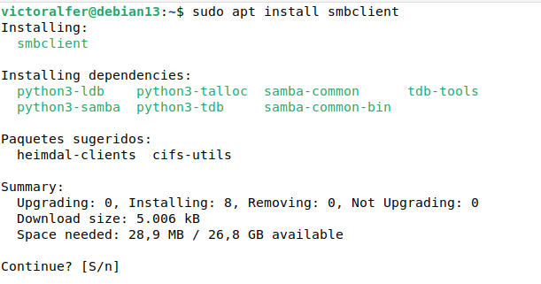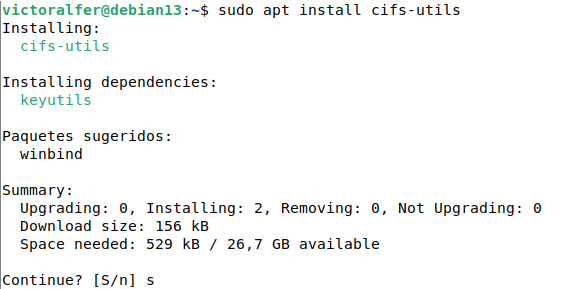

> **INSTALACIÓN** **DEL** **CLIENTE** **SMB** **Y** **UTILIDADES**
> **CIFS** **EN** **DEBIAN** **13**
>
> Para que Debian pueda "entender" y montar recursos de red de Windows,
> es necesario instalar el soporte para el sistema de archivos común de
> Internet (CIFS):
>
> **Comando** **de** **instalación** **Cliente** **SMB**: ***sudo***
> ***apt*** ***install*** ***smbclient***
>
> *Figura* *56.* *Configuración* *SMB/CIFS:* *Instalación* *Cliente*
> *SMB* *en* *Debian*
>
> **Comando** **de** **instalación** **Utilidades** **CIFS**: ***sudo***
> ***apt*** ***install*** ***cifs-utils***
>
> *Figura* *57.* *Configuración* *SMB/CIFS:* *Instalación* *Utilidades*
> *CIFS* *en* *Debian*
>
> **Justificación** **Instalación** **de** **Utilidades**
> **CIFS-UTILS**: El paquete cifs-utils proporciona las herramientas
> necesarias para utilizar el comando ***mount*** ***-t*** ***cifs***,
> permitiendo tratar una carpeta remota como si fuera un directorio
> local.
>
> **MONTAJE** **DE** **LA** **CARPETA** **COMPARTIDA** **EN** **DEBIAN**
> **13**
>
> El proceso de vinculación se realizó siguiendo estos pasos técnicos:
>
> **-** **Creación** **del** **Directorio** **-**
>
> Se creó la carpeta **“Presentacion”** dentro del directorio personal
> del usuario ***victoralfer*** ***Comando:*** ***mkdir***
> ***~/Presentacion***
>
> **27**

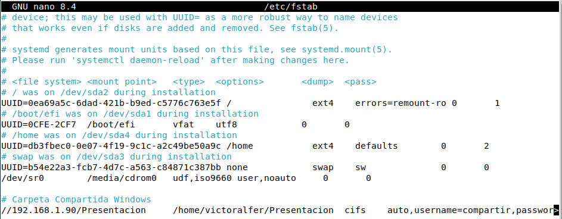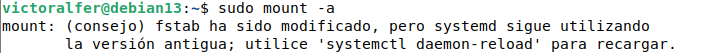

> **-** **Montaje** **Permanente** **-**
>
> Para que el montaje sea permanente tras reiniciar el servidor, se debe
> añadir la línea correspondiente en el fichero **/etc/fstab**.
>
> ***//192.168.1.90/Presentacion*** ***/home/victoralfer/Presentacion***
> ***cifs*** ***auto,username=compartir,password=XXXX*** ***0*** ***0***
>
> ➔***//192.168.1.90**:* *dirección* *IP* *del* *servidor*
> ➔***/Presentacion**:* *carpeta* *compartida*
> ➔***/home/victoralfer/Presentacion**:* *punto* *de* *montaje*
> ➔***cifs**:* *tipo* *de* *montaje*
>
> ➔***auto,username=compartir,password=XXXX**:* *opciones* *de*
> *montaje* o ***auto*** →*montaje* *automático*
>
> o ***username*** →*nombre* *del* *usuario* *para* *acceder* *al*
> *recurso* *compartido*
>
> o ***password*** →*contraseña* *del* *usuario* *para* *acceder* *al*
> *recurso* *compartido* ➔***0*** ***0**:* *parámetros* *‘dump’* *y*
> *‘pass’*
>
> *Figura* *58.* *Configuración* *SMB/CIFS:* *Montaje* *Permanente*
> *del* *Recurso* *Compartido*
>
> **-** **Aplicar** **Cambios** **de** **Montaje** **Permanente** **-**
>
> Una vez montada la carpeta, se utilizará el comando **mount** **-a**
> para aplicar los cambios:
>
> **28**
>
>  style="width:0.77067in;height:0.425in" />**8** **-** **<u>Creación de
> la Página Web</u>**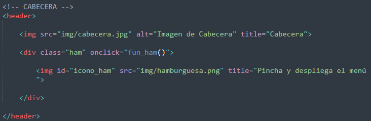 style="width:5.40778in;height:1.76528in" />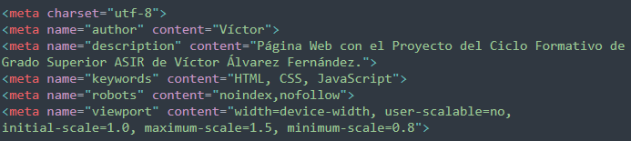 style="width:5.40875in;height:1.20972in" />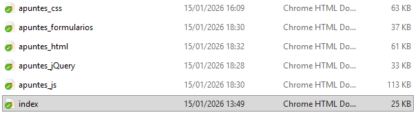 style="width:5.40861in;height:1.49653in" />
>
> El desarrollo de la interfaz se ha centrado en crear una herramienta
> útil de consulta técnica, aplicando principios de usabilidad y
> rendimiento.
>
> **DISEÑO** **DE** **LA** **ESTRUCTURA** **CON** **HTML5**
>
> Se ha empleado **HTML5** **semántico** para garantizar que el
> contenido sea accesible y fácil de indexar por los motores de
> búsqueda.
>
> ❖**Etiquetado** **Semántico**: Uso de etiquetas como *\<header\>*,
> *\<aside\>*, *\<section\>*, *\<article\>* y *\<footer\>* para
> estructurar la información de manera lógica.
>
> *Figura* *59.* *Creación* *Página* *Web:* *Etiquetado* *Semático*
>
> ❖**Metadatos**: Configuración exhaustivade etiquetas*\<meta\>*para
> definirlaautoría (Víctor), descripción del sitio y directrices para
> robots de indexación *(noindex,* *nofollow)*.
>
> *Figura* *60.* *Creación* *Página* *Web:* *Metadatos*
>
> ❖**Organización** **Modular**: El proyecto se divide en diferentes
> páginas temáticas (índice, apuntes de HTML, CSS, JS, etc.),
> facilitando la navegación del usuario.
>
> *Figura* *61.* *Creación* *Página* *Web:* *Organización* *Modular*
>
> **29**

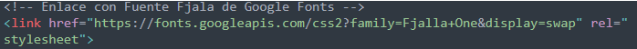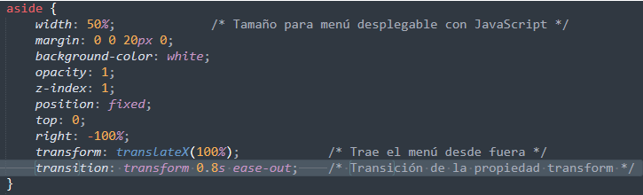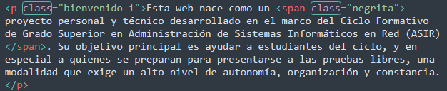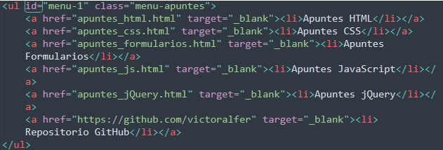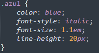

> **CREACIÓN** **DE** **UN** **ESTILO** **DEFINIDO** **CON** **CSS3**
>
> El diseño visual se apoya en **hojas** **de** **estilo** **externas**
> que definen una identidad visual profesional y moderna.
>
> ❖**Tipografía**: Integración de fuentes externas mediante Google Fonts
> *(Fjalla* *One* *y* *Anton)* para mejorar la estética y legibilidad.
>
> *Figura* *62.* *Creación* *Página* *Web:* *Tipografías* *instaladas*
>
> ❖**Efectos** **Visuales**: Implementación de transiciones suaves,
> sombreados y selectores avanzados para mejorar la experiencia de
> usuario.
>
> *Figura* *63.* *Creación* *Página* *Web:* *Efectos* *Visuales*
>
> ❖**Jerarquía** **Visual**: Uso de clases e IDs específicos para
> controlar el flujo de los elementos y la disposición de las cajas de
> contenido.
>
> *Figura* *64.* *Creación* *Página* *Web:* *Uso* *de* *Clases*
>
> *Figura* *65.* *Creación* *Página* *Web:* *Uso* *de* *IDs*
>
> *Figura* *66.* *Creación* *Página* *Web:* *Aplicación* *Clases* *en*
> *CSS*
>
> **30**

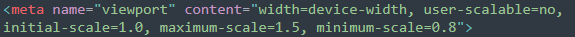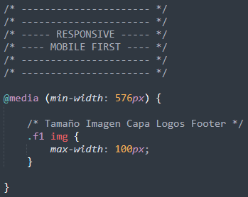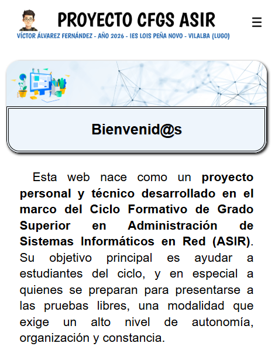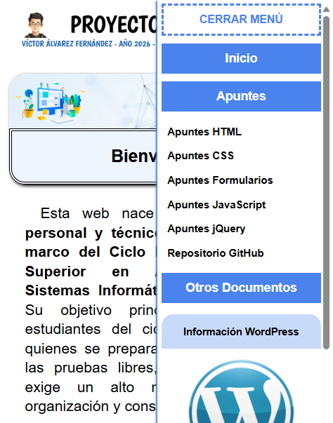

> **IMPLEMENTACIÓN** **DE** **‘RESPONSIVE** **DESIGN’**
>
> Para asegurar la correcta visualización en cualquier dispositivo
> *(móvil,* *tablet* *o* *PC)*, se han aplicado técnicas de diseño
> adaptativo:
>
> ❖**Limitación** **de** **Ancho** **de** **Contenedores**: Se ha
> implementado una directiva de diseño que limita el ancho máximo de los
> contenedores principales a **1400px**. Esta medida garantiza que en
> monitores de grandes dimensiones (27" o superiores), el campo visual
> sea el adecuado. Al evitar que el contenido se extienda
> indefinidamente, se mantiene una longitud de línea de texto óptima,
> mejorando drásticamente la legibilidad y evitando la fatiga visual del
> usuario.
>
> ❖**Viewport** **y** **Escala**: Uso de la etiqueta *\<meta*
> *name="viewport"\>* con los parámetros ***user-scalable=no*** e
> ***initial-scale=1.0*** para asegurar que el navegador renderice la
> webcorrectamente endispositivos móviles desde el primer instante.
>
> *Figura* *67.* *Creación* *Página* *Web:* *Aplicación* *de* *Viewport*
> *y* *Escalas*
>
> ❖**Menú** **Adaptativo**: El sitio cuenta con un sistema de navegación
> que alterna entre una barra de herramientas completa y un menú de tipo
> "hamburguesa" gestionado por JavaScript, optimizando el espacio en
> pantallas pequeñas.
>
> *Figura* *68.* *Creación* *Página* *Web:* *Menús* *Adaptativos*
>
> *Figura* *69.* *Creación* *Página* *Web:* *Vista* *de* *Menús* *en*
> *Smartphone*
>
> **31**

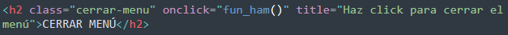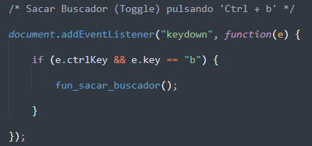

> **GENERACIÓN** **DE** **DINAMISMO** **CON** **JAVASCRIPT** **Y**
> **JQUERY**
>
> La interactividad es una pieza clave para transformar una página
> estática en una aplicación web funcional.
>
> **-** **Funcionalidades** **Implementadas** **con** **JavaScript**
> **-**
>
> ❖**Menús** **Desplegables**: Gestión del menú de navegación para
> dispositivos móviles mediante funciones de clic.
>
> *Figura* *70.* *Creación* *Página* *Web:* *Función* *para* *Ejecutar*
> *Menú* *Desplegable*
>
> ❖**Buscador** **Dinámico**: Implementación de un sistema de búsqueda
> que filtra contenidos en tiempo real y muestra mensajes personalizados
> si no hay coincidencias.
>
> *Ver* *fichero* *de* *Código:*
> [*<u>https://victoralfer.duckdns.org/otros/fun_buscador.txt</u>*](https://victoralfer.duckdns.org/otros/fun_buscador.txt)
>
> 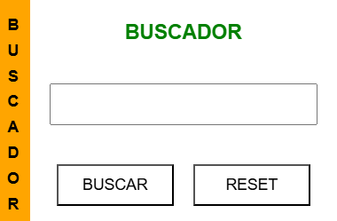❖**Funciones**
> **de** **Teclado**: Implementación de funciones de teclado para
> agilizar las consultas en el Buscador Dinámico:
>
> o ***CTRL*** ***+*** ***b*** →*Desplegar/Plegar* *el* *Buscador* o
> ***CTRL*** ***+*** ***r*** →*Resetear* *el* *Contenido* *Buscado* o
> ***CTRL*** ***+*** ***Enter*** →*Buscar*
>
> *Figura* *71.* *Creación* *Página* *Web:* *Funciones* *de* *Teclado*
>
> ❖**Navegación** **Fluida**: Inserción de botones "ancla" con
> animaciones de desplazamiento suave hacia la parte superior de la
> página *(scrollTop)*.
>
>  style="width:5.0775in;height:0.29861in" />1
>
> *Figura* *72.* *Creación* *Página* *Web:* *Sección* *Acordeón*
> *Cerrada*
>
> 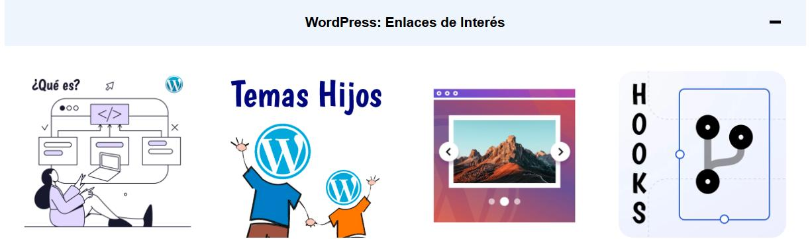 style="width:5.06181in;height:1.50069in" />2
>
> *Figura* *73.* *Creación* *Página* *Web:* *Sección* *Acordeón*
> *Abierta*
>
> **32**

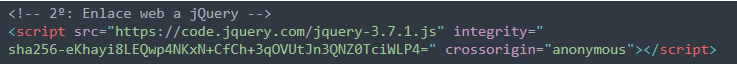

> **-** **Librería** **jQuery** **-**
>
> Se ha integrado la **versión** **3.7.1** **de** **jQuery** para
> simplificar la manipulación del DOM y gestionar eventos de forma
> eficiente.
>
> *Figura* *74.* *Creación* *Página* *Web:* *Inserción* *Librería*
> *jQuery*
>
> 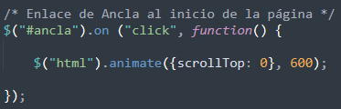 style="width:2.96375in;height:0.95347in" /> style="width:5.68042in;height:0.53542in" />*Ejemplo* *para* *Enlace*
> *de* *Ancla* *Dinámico*
>
> *Figura* *75.* *Creación* *Página* *Web:* *Función* *Enlace* *de*
> *Ancla*
>
> ➢***\$(#ancla)*** →*Captura* *de* *la* *id* *‘ancla’* *del* *HTML*
>
> ➢***.on*** ***(“click”,*** ***function()*** ***{});*** →*Acceso* *a*
> *la* *función* *con* *un* *evento* *de* ***“click”*** *(click* *con*
> *el* *ratón)* *sobre* *el* *elemento* *con* *la* *id* *‘ancla’*
>
> ➢***\$(“html”).animate({scrollTop:*** ***0},*** ***600);*** →*Función*
> *a* *ejecutar* *que* *consiste* *en* *enlazar* *con* *la* *etiqueta*
> *html* *(inicio* *de* *la* *página),* *realizando* *una* *animación*
> *con* *la* *propiedad* ***scrollTop:*** ***0*** *y* *un* *transición*
> *de* ***600*** ***ms**.*
>
> *Figura* *76.* *Creación* *Página* *Web:* *Muestra* *del* *Botón* *de*
> *Ancla* *en* *el* *Sitio* *Web*
>
> **EL** **SERVIDOR** **COMO** **REPOSITORIO** **DE** **DOCUMENTACIÓN**
> **TÉCNICA**
>
> Más allá del despliegue técnico, la página web se ha configurado para
> servir como un repositorio centralizado de apuntes sobre las
> tecnologías utilizadas en el ciclo de ASIR.
>
> ❖**Contenido** **Especializado**: Se han desarrollado páginas
> específicas para documentar el uso de etiquetas y atributos en HTML5,
> selectores y transiciones en CSS3, y manipulación de objetos y
> funciones en JavaScript.
>
> ❖**Sección** **de** **Formularios**: Se incluye una guía detallada
> sobre la creación de formularios y el uso de pseudoclases como
> *:required*, *:invalid* y *:focus*, elementos críticos para la
> interacción usuario-servidor.
>
> ❖**Guía** **de** **jQuery**: El sitio documenta el uso de la librería
> jQuery (versión 3.7.1) para la gestión de animaciones y eventos del
> DOM.
>
> ❖**Integración** **con** **WordPress**: En la página principal
> (index.html), se ha dedicado un espacio a WordPress, donde se pueden
> encontrar recomendaciones de plugins esenciales *(Sassy* *Social*
> *Share,* *YoastSEO)*, demostrando la capacidad del servidor para
> orientar sobre otras plataformas de gestión de contenidos *(CMS)*.
>
> **33**

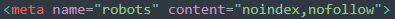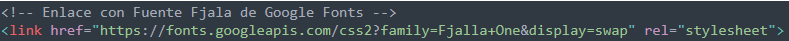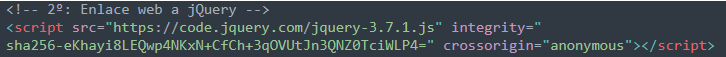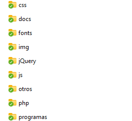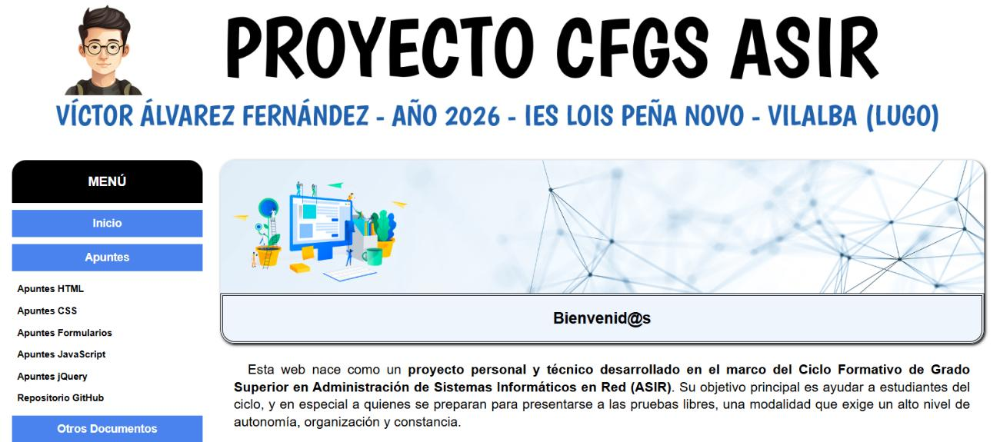

> **OPTIMIZACIÓN** **Y** **BUENAS** **PRÁCTICAS** **DE** **DESARROLLO**
>
> Basado enel análisis de los ficheros fuente, se hanimplementado las
> siguientes prácticas profesionales:
>
> ❖**SEO** **Local** **y** **Privacidad**: Uso de las ***directivas***
> ***noindex,*** ***nofollow*** en las etiquetas *\<meta* *robots\>* de
> todas las páginas para evitar que el contenido de desarrollo sea
> indexado por motores de búsqueda mientras el servidor está en pruebas.
>
> *Figura* *77.* *Creación* *Página* *Web:* *Uso* *Directivas* *noindex*
> *y* *nofollow*
>
> ❖**Gestión** **de** **Recursos** **Externos**: Integración de fuentes
> mediante Google Fonts *(Fjalla* *One,* *Anton)* y scripts de jQuery
> vía CDN, optimizando la carga y el aspecto visual sin sobrecargar el
> almacenamiento local del servidor Debian.
>
> *Figura* *78.* *Creación* *Página* *Web:* *Inclusión* *de* *Google*
> *Fonts*
>
> *Figura* *79.* *Creación* *Página* *Web:* *Inclusión* *de* *jQuery*
>
> ❖**Nomenclatura** **Profesional**: Organización de archivos mediante
> una estructura de directorios clara (css/, js/, img/).
>
> *Figura* *80.* *Creación* *Página* *Web:* *Organización* *de*
> *Archivos*
>
> *Figura* *81.* *Creación* *Página* *Web:* *Vista* *Página* *Principal*
>
> **34**
>
>  style="width:0.77067in;height:0.425in" />**9** **-** **<u>Volcado de
> los Ficheros</u>**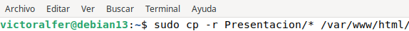 style="width:5.89903in;height:0.4493in" />
>
> Una vez configurado el servicio de archivos compartidos y el servidor
> web, se procedió a la fase de despliegue de contenidos.
>
> **PROCEDIMIENTO** **DE** **SINCRONIZACIÓN** **Y** **SEGURIDAD** **DE**
> **PUBLICACIÓN**
>
> El volcado de ficheros no se realiza de manera indiscriminada sobre el
> directorio raíz del servidor. Se ha diseñado un flujo de trabajo que
> prioriza la integridad del ***sitio*** ***web-apuntes***:
>
> ❖**Seguridad** **en** **la** **Edición**: Se ha decidido
> deliberadamente que la carpeta compartida en Windows no coincida
> directamente con la ruta de producción en el servidor Apache.
>
> ❖**Prevención** **de** **Contenido** **no** **Deseado**: Esta
> separación evita la publicación automática de
> versionesintermedias,archivos temporaleso pruebas fallidas que surgen
> durante el proceso creativo. Como es habitual en el diseño web, se
> realizan múltiples modificaciones en la estructura (HTML), el estilo
> (CSS) o el dinamismo (JS) antes de alcanzar un resultado óptimo.
>
> ❖**Control** **de** **Versiones** **Manual**: Sólo cuando el diseñador
> está satisfecho con el resultado en el entorno de edición, se procede
> al volcado final en el directorio **/var/www/html**. Esto asegura que
> el usuario final siempre visualice una versión estable y depurada del
> repositorio de apuntes.
>
> **PROCESO** **TÉCNICO** **DE** **DESPLIEGUE:** **VOLCADO** **TOTAL**
> **INICIAL**
>
> Para formalizar la subida de archivos, se utiliza un comando de copia
> que transfiere la estructura completa desde el entorno de edición al
> entorno de producción de Apache.
>
> ❖**Metodología** **de** **"Cero** **Errores"**: El volcado no se
> realiza de forma parcial; se ejecuta un volcado total una vez que el
> diseño y la funcionalidad (HTML/CSS/JS) han sido validados en el
> equipo anfitrión.
>
> ❖**Comando** **de** **Despliegue**: Se utiliza la terminal para copiar
> recursivamente el contenido, asegurando que se mantenga la jerarquía
> de directorios necesaria para los recursos estáticos (imágenes,
> scripts y estilos).
>
> ❖**Gestión** **de** **la** **Caché** **y** **Persistencia**: Al
> realizar un volcado total, se garantiza que no queden archivos
> huérfanos de versiones anteriores en el servidor, manteniendo el
> directorio /var/www/html limpio y optimizado.
>
> *Figura* *82.* *Volcado* *de* *Ficheros*
>
> ***Como*** ***es*** ***obvio,*** ***cuando*** ***se*** ***produzcan***
> ***modificaciones*** ***con*** ***el*** ***paso*** ***del***
> ***tiempo*** ***en*** ***el*** ***contenido*** ***de*** ***la***
> ***Página*** ***Web,*** ***se*** ***realizará*** ***el***
> ***proceso*** ***de*** ***copiado*** ***de*** ***los*** ***ficheros***
> ***y/o*** ***directorios*** ***necesarios,*** ***sin*** ***tener***
> ***que*** ***acudir*** ***al*** ***volcado*** ***completo.***
>
> **35**
>
>  style="width:0.77067in;height:0.425in" />**10** **-**
> **<u>Configuración de la Red
> Exterior</u>** style="width:5.90556in;height:1.78611in" />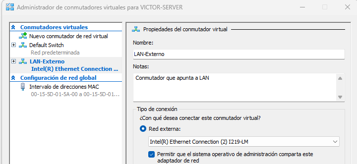 style="width:5.90556in;height:2.71458in" />
>
> Tras completar el desarrollo y las pruebas en el entorno aislado, se
> procede a la fase de publicación. Para ello, es necesario que la
> máquina virtual deje de ser un elemento interno y se convierta en un
> nodo visible dentro de la red local y, por extensión, en Internet.
>
> **CREACIÓN** **DE** **CONMUTADOR** **EXTERNO** **EN** **HYPER-V**
>
> Para permitir que la web sea accesible desde el exterior, **se**
> **sustituyó** **el** **Default** **Switch** (conmutador interno) por
> un **Conmutador** **Virtual** **Externo**.
>
> **-** **Procedimiento** **-**
>
> En el Administrador de conmutadores virtuales de Hyper-V, se creó un
> nuevo conmutador vinculado al adaptador de red físico del equipo
> anfitrión.
>
> *Figura* *83.* *Configuración* *Red* *Exterior:* *Creación*
> *Conmutador* *Virtual* *Externo*
>
> *Figura* *84.* *Configuración* *Red* *Exterior:* *Propiedades*
> *Conmutador* *Virtual* *Externo*
>
> **36**

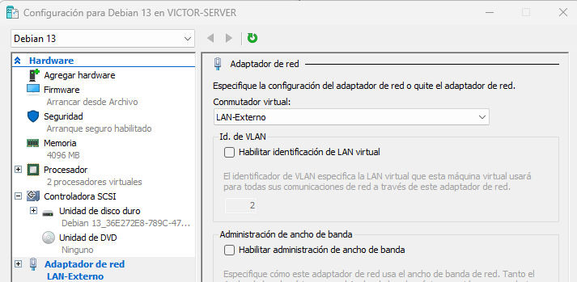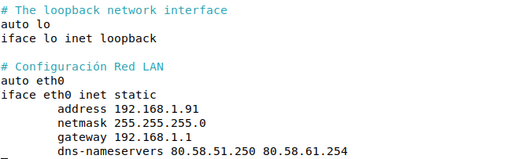

> **-** **Cambio** **en** **Máquina** **Virtual** **-**
>
> Se modificó la configuración de la máquina virtual Debian 13 para
> utilizar este nuevo adaptador, permitiendo que tenga su propia
> identidad dentro de la red física del hogar/laboratorio.
>
> *Figura* *85.* *Configuración* *Red* *Exterior:* *Elección*
> *Adaptador* *Externo* *para* *Invitado*
>
> **CONFIGURACIÓN** **DE** **LA** **INTERFAZ** **DE** **RED** **EN**
> **DEBIAN** **13**
>
> Al cambiar a un conmutador externo, fue necesario reconfigurar los
> parámetros de red de Debian para adaptarlos al rango del router
> físico:
>
> **-** **Fichero** **/etc/network/interfaces** **-**
>
> Se estableció una IP estática dentro de la red local, definiendo la
> dirección, la máscara de subred y la puerta de enlace (gateway) del
> router.
>
> ➢***Nueva*** ***Dirección*** ***IP**:* ***192.168.1.91*** ➢***Nueva***
> ***Máscara*** ***de*** ***Subred**:* ***255.255.255.0*** ➢***Nueva***
> ***Puerta*** ***de*** ***Enlace**:* ***192.168.1.1***
>
> ➢***Servidores*** ***DNS**:* ***80.58.61.250*** *y* ***80.58.61.254***
> *(los* *del* *proveedor* *ISP)*
>
> *Figura* *86.* *Configuración* *Red* *Exterior:* *Configuración* *de*
> *Red* *en* *Debian*
>
> **37**

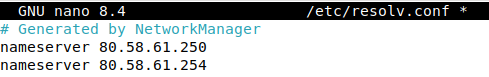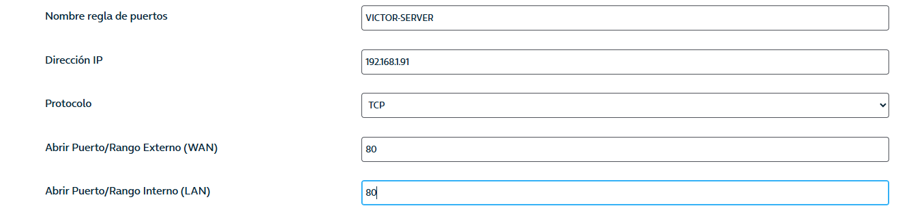

> **-** **Fichero** **/etc/resolv.conf** **-**
>
> Se añadieron manualmente los servidores DNS para garantizar que el
> servidor pueda resolver nombres de dominio externos.
>
> *Figura* *87.* *Configuración* *Red* *Exterior:* *Configuración* *DNS*
> *en* *Debian*
>
> **APERTURA** **DE** **LOS** **PUERTOS** **80** **Y** **443** **EN**
> **EL** **ROUTER**
>
> Para que el tráfico web llegue al servidor, se accedió a la
> configuración del router para realizar el Port Forwarding:
>
> ❖Se asociaron los **puertos** **80** **(HTTP)** **y** **443**
> **(HTTPS)** a la dirección IP privada estática asignada a la máquina
> virtual Debian.
>
> ❖Esto permite que cualquier petición externa dirigida a nuestra IP
> pública sea redirigida directamente al servidor Apache.
>
> *Figura* *88.* *Configuración* *Red* *Exterior:* *Apertura* *Puerto*
> *80* *(HTTP)* *en* *el* *Router*
>
> *Figura* *89.* *Configuración* *Red* *Exterior:* *Apertura* *Puerto*
> *443* *(HTTPS)* *en* *el* *Router*
>
> **RESOLUCIÓN** **DE** **PROBLEMÁTICAS** **DNS** **E** **IP**
> **DINÁMICA** **CON** **DUCKDNS**
>
> Dado que el ISP ofrece una IP dinámica *(que* *cambia* *al*
> *reiniciar* *el* *router* *o* *periódicamente)*, se implementó
> **DuckDNS** para mantener la accesibilidad.
>
>  style="width:0.13819in;height:0.13819in" />**Creación** **de**
> **cuenta** **y** **Funcionamiento**
>
> Se creó un subdominio en DuckDNS para asociar un nombre de dominio
> fijo a la IP pública variable.
>
> **Ventaja**: El servicio actualiza automáticamente el registro DNS. De
> esta forma, el dominio siempre apunta a la IP correcta,
> independientemente de los cambios realizados por el proveedor de
> Internet.
>
> **38**

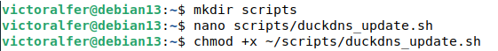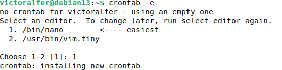

> 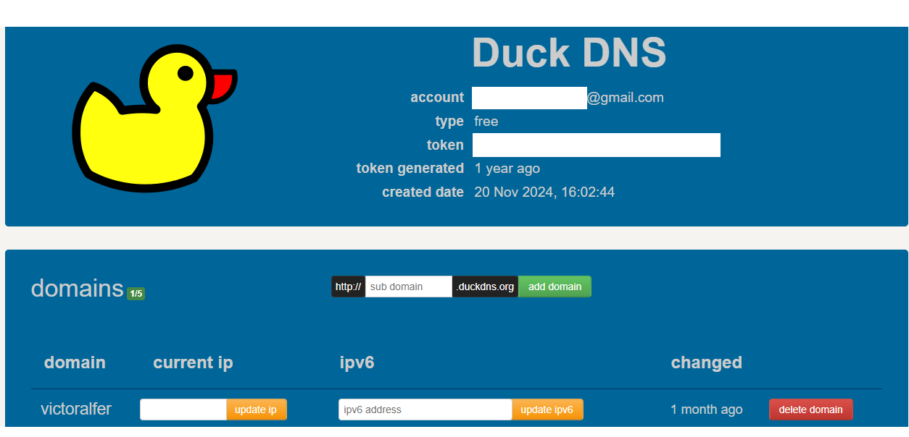 style="width:5.89935in;height:2.84383in" />*Figura* *90.*
> *Configuración* *Red* *Exterior:* *Creación* *Cuenta* *DuckDNS*
>
>  style="width:0.13819in;height:0.13819in" />**Configuración** **y**
> **Automatización** **de** **Cambio** **de** **IP** **a** **DuckDNS**
>
> Dado que el servidor Debian no puede detectar de forma nativa cuándo
> el router cambia la IP pública (ya que el servidor solo "ve" su propia
> IP privada), se ha programado un sistema de actualización activa:
>
> 1\) **Script** **de** **actualización** **(Bash)**: Se ha creado un
> pequeño script en el servidor que utiliza la herramienta CURL. Este
> comando realiza una petición HTTPS a los servidores de DuckDNS
> enviando el token y el dominio.
>
> *I.* *Creación* *del* ***directorio*** ***~/scripts*** *para* *alojar*
> *el* *script*
>
> *II.* *Creación* *del* *script* ***~/scripts/duckdns_update.sh***
> *con* *este* *contenido:* ***echo***
> ***url="https://www.duckdns.org/update?domains=victoralfer&token=TU\_***
> ***TOKEN_AQUÍ&ip="*** ***\|*** ***curl*** ***-k*** ***-o***
> ***~/scripts/duck.log*** ***-K*** ***-***
>
> *III.* *Añadir* *permisos* *de* *ejecución* *al* *script* *diseñado*
> *en* *el* *paso* *anterior*
>
> *Figura* *91.* *Configuración* *Red* *Exterior:* *Uso* *de* *Script*
> *actualización* *IP* *del* *router*
>
> 2\) **Detección** **de** **la** **IP**: Al recibir esta petición,
> **DuckDNS** **identifica** **automáticamente** **la** **dirección**
> **IP** **pública** de origen y actualiza el registro DNS en tiempo
> real. El **TOKEN** asociado a la cuenta creada es el que permite tal
> circunstancia.
>
> 3\) **Programación** **con** **Cron**: Para que el proceso sea
> totalmente autónomo y no requiera intervención manual del
> administrador, se ha configurado una tarea programada en el servicio
> Cron de Debian.
>
> *Figura* *92.* *Configuración* *Red* *Exterior:* *Automatización*
> *del* *Script* *a* *través* *del* *Servicio* *Cron*
>
> **39**

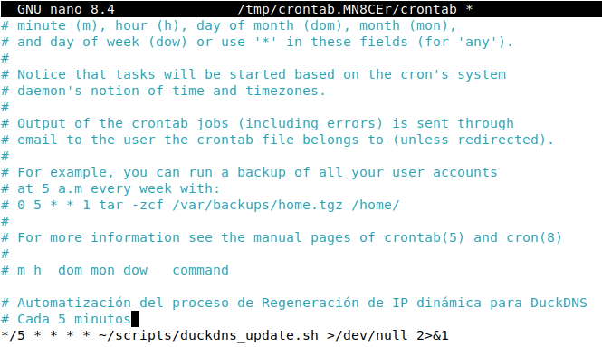

> ***<u>Configuración de la Automatización en CRON</u>***
>
> o ***Frecuencia:*** ***El*** ***script*** ***se*** ***ejecuta***
> ***cada*** ***5*** ***minutos.***
>
> o ***La*** ***salida*** ***estándar*** ***del*** ***script*** ***se***
> ***va*** ***al*** ***Dispositivo*** ***Nulo.***
>
> o ***Los*** ***posibles*** ***errores,*** ***también*** ***se***
> ***mandarán*** ***al*** ***Dispositivo*** ***Nulo.***
>
> *Figura* *93.* *Configuración* *Red* *Exterior:* *Automatización*
> *Script* *de* *Actualización*
>
> ***Resultado:*** ***Si*** ***el*** ***ISP*** ***renueva*** ***la***
> ***dirección*** ***IP*** ***a*** ***las*** ***12:00,*** ***a***
> ***las*** ***12:05*** ***el*** ***servidor*** ***ya*** ***habrá***
> ***notificado*** ***el*** ***cambio*** ***a*** ***DuckDNS,***
> ***manteniendo*** ***el*** ***tiempo*** ***de*** ***inactividad***
> ***al*** ***mínimo*** ***posible*** ***y*** ***asegurando*** ***que***
> ***la*** ***URL*** ***del*** ***proyecto*** ***esté*** ***siempre***
> ***operativa.***
>
> **40**
>
>  style="width:0.77067in;height:0.425in" />**11** **-** **<u>Pruebas de
> Funcionamiento</u>**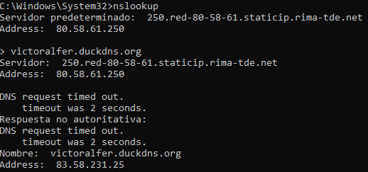 style="width:4.37403in;height:2.05208in" />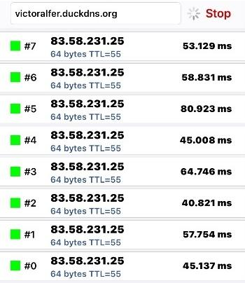 style="width:2.04583in;height:2.36306in" />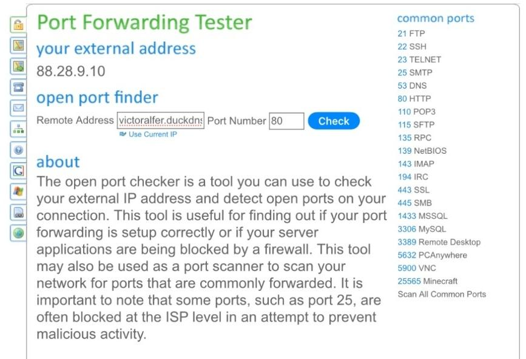 style="width:3.47305in;height:2.36944in" />
>
> Para garantizar la fiabilidad del sistema y la correcta publicación
> del servicio, se han realizado diversas baterías de pruebas que
> validan desde la conectividad de red hasta la experiencia de usuario
> final.
>
> **PRUEBAS** **DE** **CONECTIVIDAD** **Y** **RED**
>
>  style="width:0.13819in;height:0.13819in" />**Verificación** **del**
> **DNS** **Dinámico**
>
> Se ha comprobado mediante el comando **nslookup**
> ***victoralfer.duckdns.org*** que el dominio resuelve correctamente
> hacia la IP pública actual del router.
>
> *Figura* *94.* *Pruebas* *Funcionamiento:* *Verificación* *DNS*
> *Dinámico*
>
>  style="width:0.13819in;height:0.13819in" />**Test** **de**
> **Latencia**

Se realizó una **prueba** **ICMP** **desde** **un** **externa** para
verificar que el servidor es alcanzable, confirmando la correcta
configuración del conmutador externo en Hyper-V.

> **En** **concreto** **se** **hizo** **desde** **un** **móvil**
> **conectado** **a** **una** **línea** **de** **datos** **con** **la**
> **app** **“Ping”**.
>
>  style="width:0.13819in;height:0.13819in" />**Escaneo** **de**
> **Puertos**
>
> Se verificó mediante una herramienta de Escaneo que el **puerto**
> **80** **está** **“abierto”** y escuchando peticiones.
>
> ***La*** ***herramienta*** ***utilizada*** ***la*** ***podemos***
> ***encontrar*** ***en*** ***la*** ***siguiente*** ***URL:***
> [***<u>https://www.yougetsignal.com/tools/open-ports/</u>***](https://www.yougetsignal.com/tools/open-ports/)
>
> *Figura* *95.* *Pruebas* *Funcionamiento:* *Escaneo* *de* *Puertos*
>
> **41**

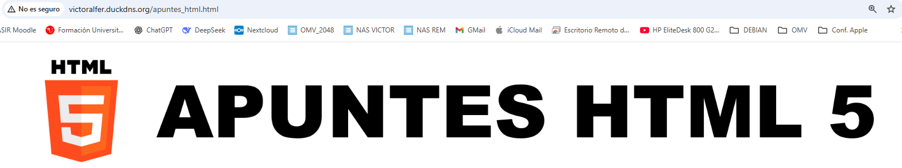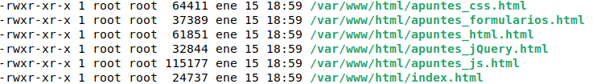

> **PRUEBAS** **DEL** **SERVIDOR** **WEB** **APACHE**
>
>  style="width:0.13819in;height:0.13889in" />**Acceso** **mediante**
> **URL**
>
> Se validó la carga de la página principal introduciendo el dominio en
> diferentes navegadores *(Chrome,* *Firefox,* *Brave…)*.
>
> *Figura* *96.* *Pruebas* *de* *Funcionamiento:* *Google* *Chrome*
>
> *Figura* *97.* *Pruebas* *de* *Funcionamiento:* *Mozilla* *Firefox*
>
> *Figura* *98.* *Pruebas* *de* *Funcionamiento:* *Brave*
>
>  style="width:0.13819in;height:0.13889in" />**Navegación** **Interna**
>
> Se comprobó la integridad delos hipervínculos entre las diferentes
> secciones de apuntes (HTML, CSS, JS, jQuery y Formularios), asegurando
> que no existan errores 404.
>
> *Figura* *99.* *Pruebas* *de* *Funcionamiento:* *Navegación* *Páginas*
> *Secundarias*
>
>  style="width:0.13819in;height:0.13819in" />**Permisos** **de**
> **Archivos**
>
> Se verificó que tras el volcado por SMB/CIFS, los archivos conservan
> los permisos necesarios para que el usuario www-data pueda servirlos
> correctamente.
>
> *Figura* *100.* *Pruebas* *de* *Funcionamiento:* *Ver* *Permisos* *de*
> *los* *Ficheros* *HTML*
>
> **42**

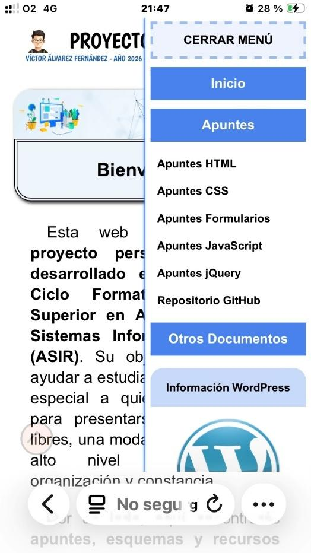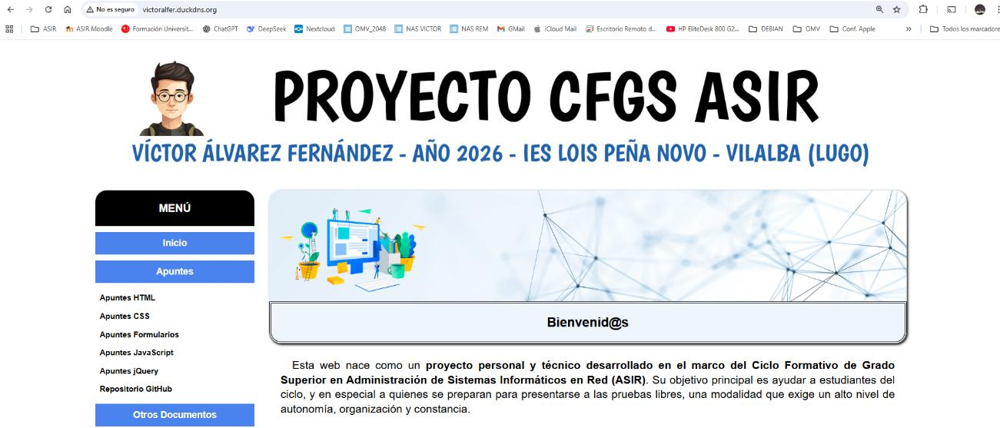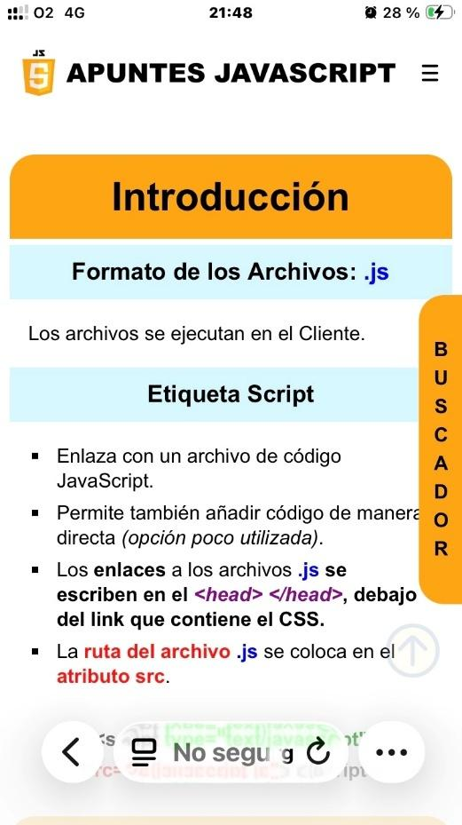

> **PRUEBAS** **DE** **DISEÑO** **Y** **CONTENIDO** **RESPONSIVE**
>
>  style="width:0.13819in;height:0.13889in" />**Adaptabilidad**
>
> Se utilizaron **diferentes** **dispositivos** para comprobar que el
> contenido se adaptaba a ellos. Además, se confirmó que el **menú**
> **"hamburguesa"** se despliega correctamente y que el diseño se ajusta
> a las pantallas pequeñas.
>
> *Figura* *101.* *Pruebas* *de* *Funcionamiento:* *Adaptabilidad*
> *Páginas* *Principal* *y* *Secundarias*
>
>  style="width:0.13819in;height:0.13889in" />**Control**
> **Visualización**
>
> Se testeó el sitio en monitores de alta resolución, verificando que
> los contenedores respetan el **máximo** **de** **1400px**, manteniendo
> la lectura centralizada y cómoda.
>
> *Figura* *102.* *Pruebas* *de* *Funcionamiento:* *Control*
> *Visualización* *(máximo* *1400px)*
>
> **43**

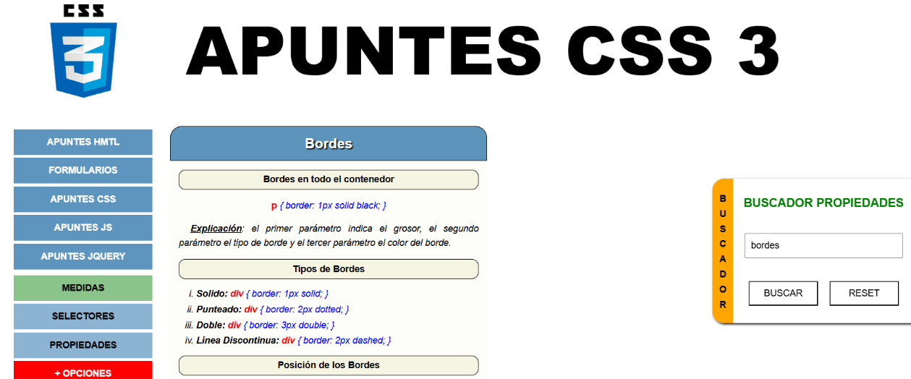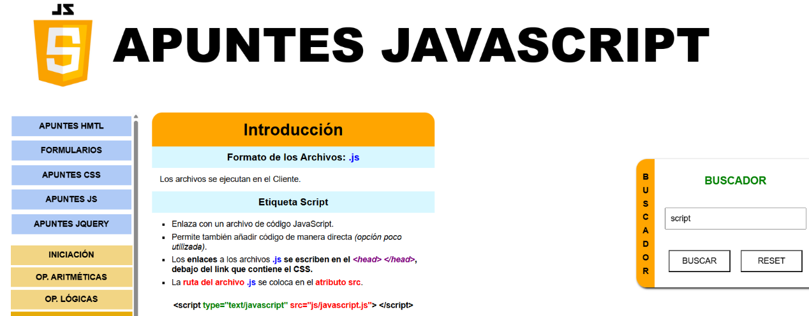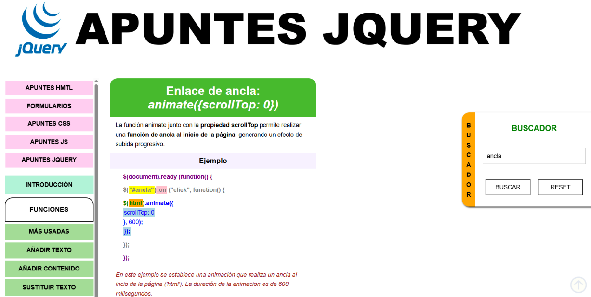

> **PRUEBAS** **DE** **DINAMISMO** **(JS** **y** **jQuery)**
>
>  style="width:0.13819in;height:0.13889in" />**Búsquedas** **en**
> **Tiempo** **Real**
>
> Se realizaron búsquedas de términos específicos *(ej.* *"bordes",*
> *"script",* *"ancla")* para validar que el script de filtrado funciona
> y que, ante búsquedas fallidas, se muestra correctamente la capa de
> "No hay coincidencias".
>
> *Figura* *103.* *Pruebas* *de* *Funcionamiento:* *Buscador* *Página*
> *Apuntes* *CCS3*
>
> *Figura* *104.* *Pruebas* *de* *Funcionamiento:* *Buscador* *Página*
> *Apuntes* *JS*
>
> *Figura* *105.* *Pruebas* *de* *Funcionamiento:* *Buscador* *Página*
> *Apuntes* *jQuery*
>
> **44**

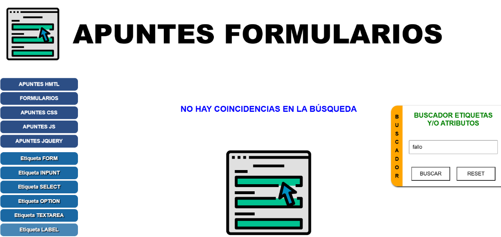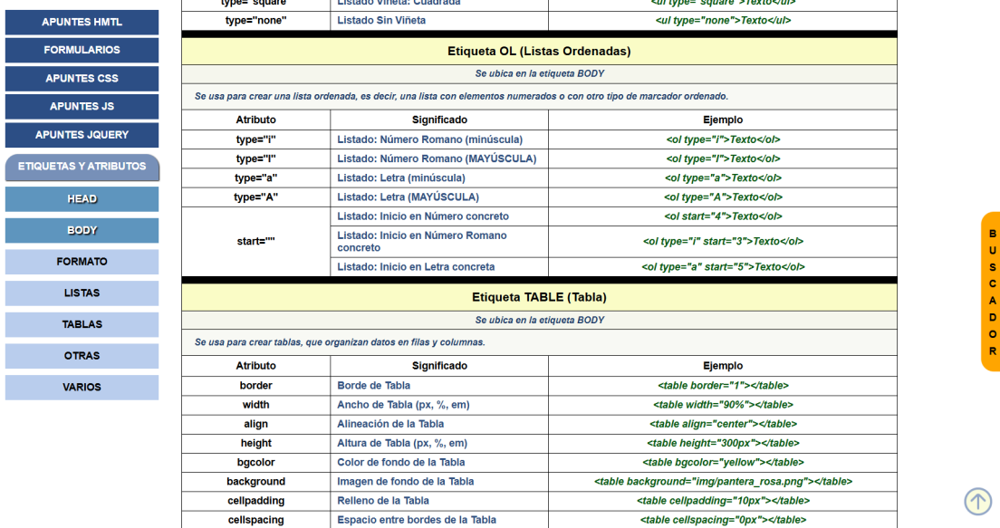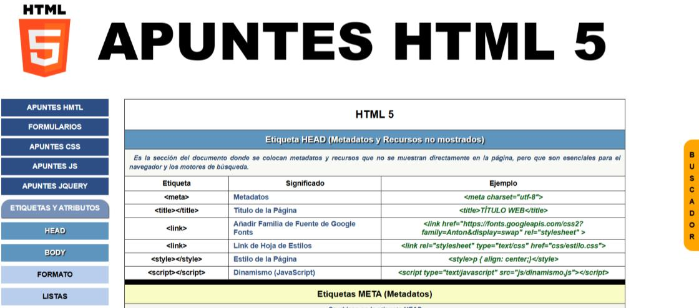

> *Figura* *106.* *Pruebas* *de* *Funcionamiento:* *Buscador* *Página*
> *Apuntes* *Formularios*
>
>  style="width:0.13819in;height:0.13819in" />**Ancla** **Superior**
>
> Se comprobóqueelbotónde **"Volverarriba"**realiza el
> desplazamientosuave *(scrollTop)* mediante la animación de jQuery
> programada.
>
> *Figura* *107.* *Pruebas* *de* *Funcionamiento:* *Botón* *de* *Ancla*
> *sin* *accionar*
>
> *Figura* *108.* *Pruebas* *de* *Funcionamiento:* *Botón* *de* *Ancla*
> *accionado*
>
> **45**
>
>  style="width:0.77067in;height:0.425in" />**12** **-**
> **<u>Conclusiones y Mejoras</u>**
>
> **CONCLUSIONES** **DEL** **PROYECTO**
>
> Tras la finalización del despliegue y la puesta en marcha del
> servidor, se han alcanzado satisfactoriamente todos los objetivos
> planteados inicialmente. Las conclusiones principales son:
>
> A. **Sostenibilidad** **y** **Rendimiento**: Se ha demostrado que el
> hardware reacondicionado es una plataforma robusta y eficiente para
> entornos de servidor, permitiendo una segunda vida útil al equipo sin
> comprometer el rendimiento del servicio web.
>
> B. **Dominio** **de** **la** **Virtualización**: La implementación
> sobre Hyper-V ha permitido aislar los servicios y optimizar los
> recursos del anfitrión, facilitando una gestión segura y escalable
> mediante el uso de conmutadores virtuales externos.
>
> C. **Consolidación** **de** **Conocimientos** **ASIR**: El proyecto
> integra de forma transversal áreas críticas como la administración de
> sistemas Linux (Debian 13), redes (NAT, DNS Dinámico, Direccionamiento
> IP), seguridad (VPN Tailscale, Firewalls, …) y servicios de archivos
> (SMB/CIFS).
>
> D. **Desarrollo** **Web** **Profesional**: La creación del repositorio
> de apuntes no solo sirve como herramienta de consulta técnica, sino
> que, valida la capacidad de crear interfaces modernas, interactivas
> (jQuery/JS) y optimizadas para grandes monitores mediante el control
> de contenedores a 1400px.
>
> **POSIBLES** **MEJORAS** **Y** **FUTURAS** **AMPLIACIONES**
>
> Aunque el sistema es totalmente funcional, se plantean las siguientes
> líneas de mejora para futuras iteraciones:
>
> ➢**Copia** **de** **Seguridad** **Automatizada**: Configurar un
> sistema de backups incrementales que almacene copias de seguridad de
> la base de código y la configuración de la VM en una unidad externa o
> servicio de nube.
>
> ➢**Creación** **de** **un** **Servicio** **de** **Correo**
> **Electrónico**: Configurar un servidor de correo propio dentro del
> entorno virtualizado.
>
> ➢**Implementación** **de** **un** **Servicio** **FTP**: Añadir un
> servidor de transferencia de archivos para ofrecer una alternativa al
> volcado por SMB/CIFS.
>
> ➢**Ampliación** **de** **Hardware**: Aprovechar la arquitectura del
> equipo para realizar una expansión de la memoria RAM hasta los 16 GB.
>
> ➢**Contenido**: Incrementar el contenido de la Página Web con la
> inclusión de apuntes de otros módulos del Ciclo Formativo de Grado
> Superior ASIR.
>
> **46**
>
>  style="width:0.77067in;height:0.425in" />**13** **-**
> **<u>Bibliografía</u>**
>
> **MATERIAL** **ACADÉMICO** **Y** **DOCENTE**
>
> La base técnica y teórica de este proyecto se sustenta primordialmente
> en el conocimiento adquirido durante el presente ciclo formativo,
> utilizando como fuentes principales:
>
> ❖**Apuntes** **y** **Documentación** **Técnica** **del** **Aula**
> **Virtual**: *Material* *didáctico* *proporcionado* *por* *el*
> *equipo* *docente,* *centrado* *en* *la* *administración* *de*
> *sistemas* *operativos* *(Debian* *13),* *virtualización* *en*
> *entornos* *y* *gestión* *de* *redes* *locales.*
>
> ❖**Sesiones** **Prácticas** **y** **Laboratorios**: *Conocimiento*
> *adquirido* *en* *las* *horas* *de* *estudio,* *especialmente* *en*
> *lo* *referente* *a* *la* *configuración* *de* *servicios* *Apache,*
> *protocolos* *de* *transferencia* *de* *archivos* *y* *seguridad*
> *perimetral.*
>
> ❖**Guías** **de** **Configuración** **Propias**: *Documentación*
> *elaborada* *durante* *el* *curso* *a* *partir* *de* *los* *apuntes*
> *realizados* *por* *los* *profesores* *de* *los* *módulos* *de*
> *"Implantación* *y* *Administración* *de* *Sistemas* *Operativos",*
> *"Planificación* *y* *Administración* *de* *Redes",* *"Servicios* *de*
> *Red* *e* *Internet"* *y* *"Lenguaje* *de* *Marcas* *e* *Implantación*
> *de* *Aplicaciones* *Web".*
>
> **BIBLIOGRAFÍA** **DE** **CONSULTA** **TÉCNICA**
>
> Para el desarrollo de las distintas áreas del proyecto, se han
> consultado los siguientes manuales de referencia académica:
>
> **-** **Módulos** **de** **Sistemas** **y** **Redes** **(Ed.**
> **Garceta)** **-**
>
> ❖**Fundamentos** **del** **Hardware**: *Utilizado* *para* *la*
> *selección* *y* *optimización* *del* *equipo* *físico*
> *reacondicionado* *y* *la* *gestión* *de* *recursos* *de*
> *almacenamiento* *SSD.*
>
> ❖**Planificación** **y** **Administración** **de** **Redes**: *Base*
> *para* *el* *diseño* *del* *direccionamiento* *IP,* *configuración*
> *de* *conmutadores* *virtuales* *en* *Hyper-V* *y* *protocolos* *de*
> *red* *local.*
>
> ❖**Seguridad** **y** **Alta** **Disponibilidad**: *Referencia* *para*
> *la* *implementación* *de* *la* *VPN* *(Tailscale),* *el* *acceso*
> *remoto* *seguro* *y* *la* *continuidad* *del* *servicio* *mediante*
> *DNS* *dinámico.*
>
> **-** **Módulos** **de** **Desarrollo** **Web** **(Ed.**
> **Paraninfo)** **-**
>
> ❖**UF1302** **a** **UF1306**: *Manuales* *técnicos* *para* *la*
> *creación,* *maquetación,* *programación* *y* *prueba* *de* *páginas*
> *web,* *que* *han* *servido* *de* *referencia* *para* *asegurar* *que*
> *el* *repositorio* *de* *apuntes* *cumple* *con* *los* *estándares*
> *actuales.*
>
> **DOCUMENTACIÓN** **OFICIAL** **DE** **SISTEMAS** **Y**
> **VIRTUALIZACIÓN**
>
> ❖**Microsoft** **Learn** **-** **Hyper-V** **Technology**
> **Overview**: *Documentación* *técnica* *sobre* *la* *arquitectura*
> *de* *microkernel* *de* *Hyper-V* *y* *gestión* *de* *conmutadores*
> *virtuales.*
>
> **47**
>
> **REDES** **Y** **CONECTIVIDAD**
>
> ❖**DuckDNS** **Documentation**: *Especificaciones* *de* *la* *API*
> *para* *la* *actualización* *de* *registros* *DNS* *dinámicos*
> *mediante* *métodos* *HTTP* *(curl).*
>
> ❖**Tailscale** **Documentation**: *Guía* *de* *implementación* *de*
> *redes* *privadas* *virtuales* *(VPN)* *basadas* *en* *el* *protocolo*
> *WireGuard.*
>
> **48**
